# PynamicMesh: Dynamic Mesh Modeling & Analysis Tool 


# How to Install
[Creating a new conda environment](https://docs.conda.io/projects/conda/en/latest/user-guide/tasks/manage-environments.html#creating-an-environment-with-commands) or a [virtual environment](https://docs.python.org/3/library/venv.html) with **Python 3.10+**.

```bash
conda create -y -n PynamicMesh -c conda-forge python=3.11
conda activate PynamicMesh
```

Clone the repo and install dependencies:

```bash
git clone https://github.com/MMV-Lab/PynamicMesh
cd PynamicMesh
pip install .
```

# Example Data

All the following examples can be replicated using the [meshes](./examples/Mesh_models/) and the generated example files provided [here](./examples), and all the code usage syntax is summarized in the provided [code](./examples/execution_examples.py).

The provided tools were developed independently into pure computations and visualization/graphical tools in order to keep the flexibility of running the computations on a pure non-graphic node or high-performance computing cluster.

# Project overview

Given a family of meshes $\mathscr{M} = \{ M_{t_i} | 0 \leqslant i \leqslant T \}$ where each mesh $M_{t_i}$ encodes the spatial deformation of the shape at a specific time $t_i$, we deal with a shape deformation that provides a full geometrical encoding of the dynamics related to the deformation.

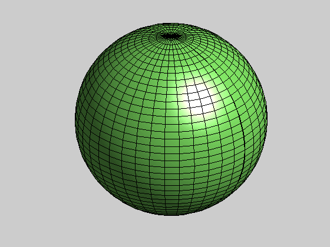

PynamicMesh offers a full general range of pipelines based on Topology, Differential Geometry, and Physics in order to model the complex dynamics encoded in the transformation, allowing the extraction of features that help to characterize and understand the dynamical process.

For a detailed and applied understanding of meshes as Manifolds and triangulations, the following [Jupyter Notebook](https://github.com/JairMathAI/Understanding_Persistent_Homology/blob/main/Persistent_Homology.ipynb) might interest you.

<details>
<summary><strong><span style="font-size:25px;">Functional Map</span></strong></summary>

<details>
<summary><span style="font-size:23px;">Understanding Functional Map Construction</span></summary>

The functional map $(\mathscr{FM})$ allows computing a matrix representation of an unknown transformation function between meshes $\mathscr{FM}: \mathcal{F}(M_1,M_2) \to \mathbb{M}_{k \times k}(\mathbb{R})$.

Given two consecutive time step meshes $M_{t_{i-1}}$ and $M_{t_{i}}$, we can think about them in terms of their respective vertices (points) and faces (triangles): $\{\mathcal{V},\mathcal{F}\}_{t_{i-1}}$ and $\{\mathcal{V},\mathcal{F}\}_{t_{i}}$.

The goal is to find a representation of the unknown bijective transformation function $\varphi_n : M_{t_{i-1}} \to M_{t_{i}}$ that describes how the mesh is transformed in space.

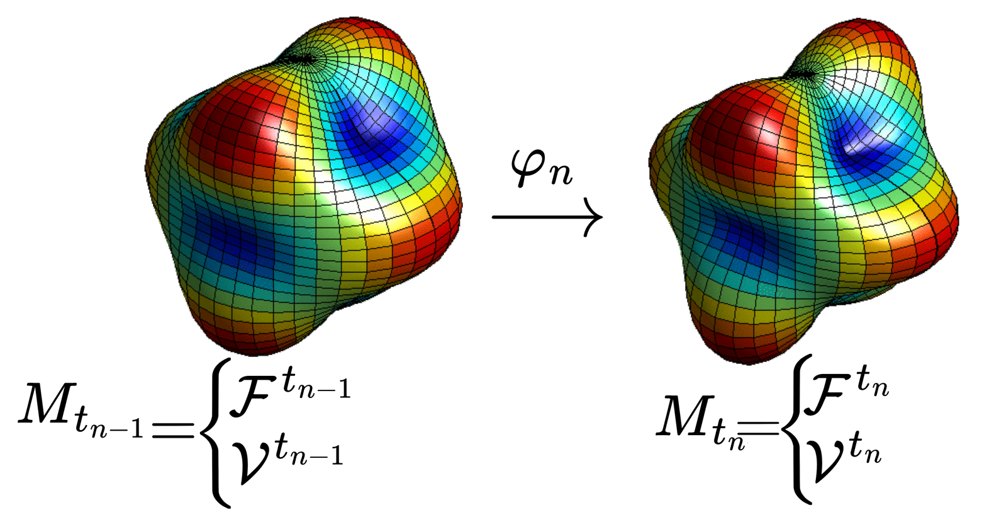

We can use a scalar function defined over each mesh $\psi_{t_{i-1}}: M_{t_{i-1}} \to \mathbb{R}$ and $\psi_{t_i}: M_{t_i} \to \mathbb{R}$ which produces the relation $\psi_{t_i} = \psi_{t_{i-1}} \circ \varphi_n^{-1} = \psi_{t_{i-1}}(\varphi_n^{-1})$.

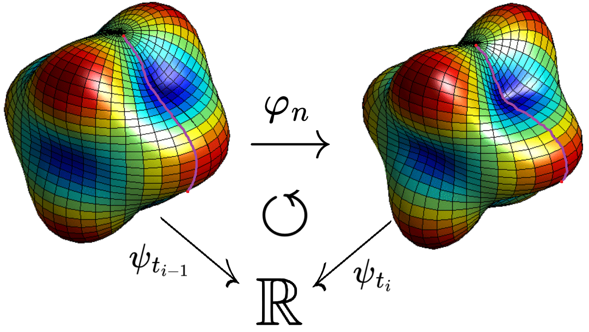

In our case we are goind to use the Dirichlet energy on each point of the mesh for the wave propagation function, the heat diffusion function, or the sum of both: $\displaystyle E[\Psi]=\frac{1}{2}\int ||\Psi(x)||^2 dx$.

<div style="display: flex; gap: 10px; flex-wrap: wrap;">
  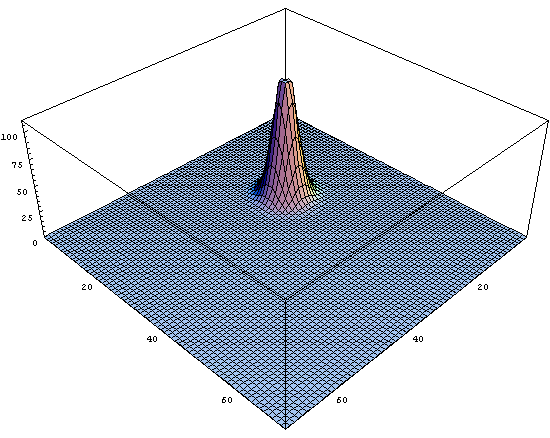
  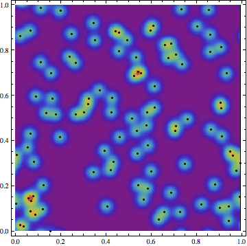
</div>

The composition $\psi_{t_{i-1}}(\varphi_n^{-1})$ induce a linear functional, such that for every function $f:M_{t_{i-1}} \to \mathbb{R}$ we have $\mathcal{F}_{\varphi_n}(f) = f(\varphi_n^{-1})$, so we have the functional transformation $\mathcal{F}_{\varphi_n} : \mathcal{L}(M_{t_{i-1}},\mathbb{R}) \to \mathcal{L}(M_{t_{i}},\mathbb{R})$ where the task to find $\varphi_n$ now means finding a representation for the functional $\mathcal{F}_{\varphi_n}$.

As the linear function spaces $\mathcal{L}(M_{t_{i-1}},\mathbb{R})$ and $\mathcal{L}(M_{t_{i}},\mathbb{R})$ are vector spaces, so they should have a basis of functions $\displaystyle \{\phi_j ^{M_{t_{i-1}}}\}_{j\in J}$ and $\displaystyle \{\phi_k^{M_{t_{i}}}\}_{k\in K}$ so let's find it using the Laplace-Beltrami operator.

If we apply the [ Finite Element Method (FEM)](https://en.wikipedia.org/wiki/Finite_element_method#Discretization) to the Laplace-Beltrami equation of a function $f$ on a triangle mesh $\Delta f = - div( \nabla f)$.

Means that we want to compute the gradient of a function defined on a triangle, but locally the function varies linearly within each triangle $\Delta f = |f(v_j)-f(v_i)|$ . When we integrate the squared gradient over the surface $\displaystyle \frac{1}{2}\sum |f(v_j)-f(v_i)|^2 $, the result simplifies to a weighted sum of the differences between neighboring vertex values.

$$\frac{1}{2}\sum_{ij} w_{ij} [f(v_j)-f(v_i)]$$

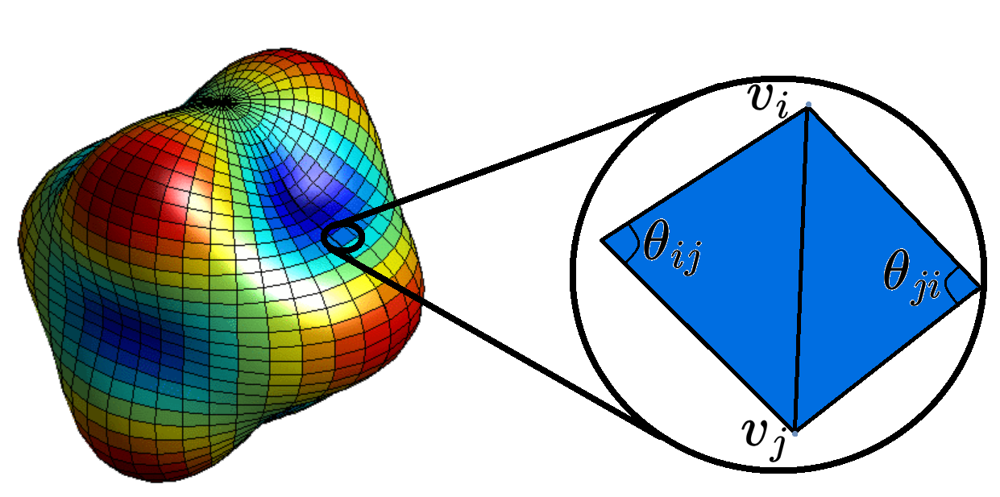

We can contruct the Connectivity matrix or the [Cotan-Laplace operator](https://en.wikipedia.org/wiki/Discrete_Laplace_operator)

The "connectivity" is encoded in the adjacency of the mesh. The Laplacian matrix $L$ is constructed as:

$$L_{ij} = \left\{ \begin{array}{cl}
-w_{ij} & : v_i\to v_j \text{conected}\\
0 & : \text{ no conexion} \\
\end{array} \right.$$

For the diagona the sum of weights of all edges connected to $v_i$

$$ L_{ii} = \sum w_ii $$

This matrix $L$ effectively describes how the Dirichlet energy (heat, or waves) flows from vertex i to its neighbors. Because it is built using the cotangents of the actual angles in the mesh, it is geometry-aware it accounts for the shape and skewness of the triangles, not just the connectivity.

Then for every vertex $v_i$ on the mesh we can compute the Barycentric Area (one-third of the sum of the areas of all triangles T that are connected to that $v_i$) $\displaystyle A_{i} = \frac{1}{2}\sum_{T\in\mathcal{F}(i)} Area(T) $ where $\displaystyle Area(T)=\frac{1}{2}||(v_2-v_1)\times(v_3-v_1)||$ and $(v_3,v_2,v_3)$ are the vertex of a triangle. We can construct the diagonal matrix:

$$W_{ij} = \left\{ \begin{array}{cl}
A_i & : i=j\\
0 & \text{ other case} \\
\end{array} \right.$$

This matrix essentially encode the surface area contribution of each vertex. Because a mesh is made of triangles, the "area" of a vertex is defined by the triangles that share it.

Then we can solve the generalized eigenvalue decomposition for a matrix $\Phi$

$$L\Phi=W\Lambda\Phi$$

Only for the first $k$ eigenvectors we do not compute all the eigenvectors (which would be computationally expensive). Since functional maps typically work on the first $k$ "low-frequency" eigenfunctions (the "spectral footprint").

Once solved, each column $\phi_j$​ of the matrix $\Phi$ contains the values of the $j$-th eigenfunction at every vertex of the mesh.

We can obtain this matrix for the $t_{i-1}$ mesh  $\Phi^{M_{t_{i-1}}}$ and the $t_i$ mesh $\Phi^{M_{t_{i}}}$ to obtain the respective basis from the domain and the codomain of $\varphi_n$.

In theory this basis allows to express our fucntional as a linear combination: 

$$\mathcal{F}_{\varphi_n}(f) = \sum_k\sum_j a_jc_{jk}\phi_k^{M_{t_{i}}}$$

This provide a matrix representation $\mathcal{C}$ determined by the coefficents $c_{jk}$ 

We can express this coeficents using a inner product to project the tranformation represented on the domain base into the codomain base: 

$$\displaystyle c_{jk}= \left\langle \mathcal{F}_{\varphi_n}(\phi_k^{M_{t_{i}}}) , \phi_j ^{M_{t_{i-1}}} \right\rangle$$

But now we have a matrix representation $c_{jk}$ but it depens on $\varphi_n$ which is unknow and to describe $\varphi_n$ somehow we need to find $c_{jk}$

We can use our Dirichlet energy descriptors in order of get a clue:

We can project the Dirichlet energy on mesh $M_{t_{i-1}}$ And on mesh $M_{t_{i}}$ to obtain the vectors:

$$ \Psi^{t_{i-1}} =  \Phi^{T} W E[\Psi] \hspace{6mm} \Psi^{t_{i}} =  \Phi^{T} W E[\Psi]  $$

The functional map matrix $\mathcal{F}_{\varphi_n} = C_{t_{i-1} \to t_{i}} \in \mathbb{M}_{k \times k}(\mathbb{R})$ that we seek now is given for the one that minimizes the following objective function:

$$
\min_{C} E(C) = \underbrace{\sum_{m=1}^{n_f} \| C \Psi^{t_{i-1}}_m - \Psi^{t_{i}}_m \|^2}_{E_{desc}} + \underbrace{\lambda_{reg} \| C \Lambda_1 - \Lambda_2 C \|^2}_{E_{reg}} + \underbrace{\lambda_{land} \sum_{l=1}^L \| C \Phi_1(x_l, :)^\top - \Phi_2(y_l, :)^\top \|^2}_{E_{land}}
$$

Were:

$n_f$: Number of descriptor functions (one in our case).

$\Lambda_1,\Lambda_2:$ Diagonal matrices of eigenvalues for Mesh $t_{i-1}$ and Mesh $t_i$.

$\Phi_1(x_l, :):$ The row vector of the eigenfunction matrix $\Phi_1$​ corresponding to landmark vertex $x_l$.

$\lambda_{reg},\lambda_{land}:$ Scalar weighting parameters to balance the influence of the three energy terms.

$E_{desc} :$ Forces the map to align the chosen descriptors.

$E_{reg}:$ Enforces the structural consistency (commutativity) of the transformation.

$E_{land}:$ Anchors the map at specific known landmark correspondences $(x_l,y_l)$ (Symetries constrain).

This optimal matrix $C$ contain the spectral map representation (egenfunction domain). To recover the spatial tranformation vector (vertex domain) $\vec{v}\in \mathbb{N}^k$ where $v_i=j$ describe de correspondance vertex to vertex transformation:

We need to take the basis representation of a point $x_j\in M_{t_{i-1}}$​, which is simply the $j$-th row of $\Phi_1$, denoted $\Phi_1(j, :)$.

And then transform it to the spectral domain of $M_{t_{i}}$: 
$$b_{x_j}=C\Phi_1(j, :)^\top$$

Take the vertex $k$ in $M_{t_{i}}$ that is closest to this transformed representation:

$$v_j = \arg \min_{k \in \text{Vertices}(M_{t_{i}})} \| \Phi_2(k, :)^\top - C \Phi_1(j, :)^\top \|^2$$

Having this matrix representation, we can compute a large variety of descriptors to characterize the dynamics.

The full pipeline can be summarized through the following scheme:

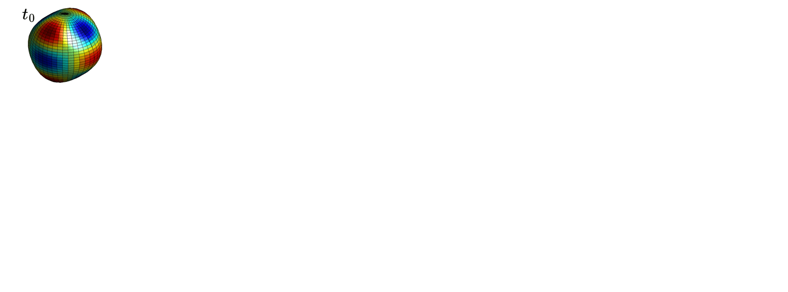

</details>

<details>
<summary><span style="font-size:23px;">Functional Map Implementation Usage and Analysis</span></summary>

The computations are executed and managed through the syntax:

```python
from PynamicMesh.core.pipelines import run_pipeline
run_pipeline(**args)
```

In order to compute the Functional Map transformations, run:

```python
from PynamicMesh.core.pipelines import run_pipeline
run_pipeline(
    path_str='base/path',
    matrix_tranformation=True,
    diagonal_analysis=True,
    isometric_analysis=True,
    k_eigenfunc=100,
    descriptor='WKS+HKS',
    landmarks='precomputed',
    compute_physic_fields=True,
)
```

Or you can set your parameters on the [yaml](./examples/config.yaml) file, and within the PynamicMesh enviroment run on the comand line:

```python
run_pynamic --config /path/to/the/config.yaml
```


<details>
<summary><span style="font-size:21px;"> Functional Map Parameters</span></summary>

Path to the root folder that contains the scenes:
```python 
path_str (str) 
```   

Flag to indicate the model execution:
```python 
matrix_tranformation (bool)
```  

Flag to indicate the isometry analysis execution within the loop:
```python 
isometric_analysis (bool)
```

Flag to indicate the diagonal analysis execution within the loop:
```python 
diagonal_analysis (bool)
```

Flag to indicate the computation and storage of the physical fields (once); if it is false, the visualizer will compute them during execution time every time.
```python 
compute_physic_fields (bool)
```
    
Energy function used on the pipeline: WKS (wave propagation kernel), HKS (heat diffusion kernel), or WKS+HKS (both).
```python 
descriptor (str): 'HKS' | 'WKS' | 'WKS+HKS'
``` 
    
Number of eigenfunctions used on the matrix computation matrix of size $k_\text{eigenfunc} \times k_\text{eigenfunc}$:
```python 
k_eigenfunc (int)
```     

Vertex indices indicators for symmetry restriction:
```python 
landmark (list|str):
``` 

<details>
<summary><span style="font-size:19px;">Landmark Options</span></summary>

No symmetry restrictions applied:   
```python 
landmark (str) : None
``` 
A priori known indices of the $n$ symmetrical vertices (when the same works for all transformations):
```python
landmark (list) : [1,2,3,4,..,n] -> (n,)
``` 

A priori known indices of the symmetrical vertices (one per considered transformation). If the list contains fewer sets of vertices than the pairs of meshes, the remaining computations will perform without restrictions.
```python 
landmark (list) : [[1,..,n1],..,[1,..,nk]] -> (n,m)
``` 

A priori known pair indices of the symmetrical vertices; here $[j,k]$ means that the $v_j$ vertex of the mesh $M_{t_{i-1}}$ is related to the $v_k$ vertex of the mesh $M_{t_i}$ (the same pair applied to every transformation).
```python 
landmark (list) : [[1,2],...,[j,k]] -> (2,n)
``` 

A priori known pair indices of the symmetrical vertices (one set of relations considered per transformation). If the list contains fewer sets of vertex relations than the pairs of meshes, the remaining computations will perform without restrictions.
```python 
landmark (list) : [[[1,2],...,[j,k]],...,[[1,2],...,[l,m]]]] -> (m,2,n)
```

<b>Note:</b>

The independent function `precompute_landmarks(root_path,'FM')` can be used along with the graphical tool to click over the vertex selection for every scene in the project. Alternatively, the function `visual_selection_edition(path_to_meshes,'FM')` is included to precompute or edit existing landmarks for a specific scene. Both functions will generate a `landmark.npy` file with the corresponding selected vertex relations, and this option will check for this precomputed `.npy` file during execution.

```python 
landmark (str) : 'precomputed'
``` 
</details>
</details>

<details>
<summary><span style="font-size:21px;">Landmarks Graphical Selection</span></summary>

For the precomputed landmarks:

```python
from PynamicMesh.core.custom_fm import precompute_landmarks

precompute_landmarks("./PynamicMesh/Mesh_models",'FM')
```

Vertices are chosen by clicking over them and unmarked by clicking again over the selected vertex. When the selection is ready, just close the window in order to pass to the next mesh and the pipeline is the same.

The vertex selection should be performed in the same order for each mesh so the right related pairs are formed. The selected vertices should roughly correspond to the same related regions of the meshes.

At the end, the `.npy` file with our vertex selection on each frame will be stored in the path `./PynamicMesh/Results/scene1/landmark.npy`.


If we use the other function:

```python
from PynamicMesh.core.custom_fm import visual_selection_edition

visual_selection_edition("./PynamicMesh/Mesh_models/scene1",'FM')
```

The visualizer is going to show the specific mesh dynamics and the landmarks created previously, giving the chance to edit them or also create them if they do not exist.

In this case, in order to change among meshes in time, use the arrow keys on the keyboard. When the edition is finished, just close the window and it will be stored. 


</details>

<details>
<summary><span style="font-size:21px;"> Physical Features and Map Transformation Models </span></summary>

We can run our matrix transformation computing; at the end of the run, the pipeline will save one matrix per transformation (`FMC_ij.npy`) and the corresponding vector of vertex transformations (`FMV_ji.npy`) within the folder `./PynamicMesh/Results/scene1/Transform_Matrices/`.

Let's run first the pipeline without landmarks to see the results.

```python
from PynamicMesh.core.pipelines import run_pipeline
run_pipeline(base_mesh_path, matrix_tranformation=True, descriptor='WKS+HKS', landmarks=None, k_eigenfunc=100)
```

Compute the descriptors and visualize them with:

```python
from PynamicMesh.core.physic_model import visualize_physics
visualize_physics("./PynamicMesh/Mesh_models/", "./PynamicMesh/Results/scene1/Transform_Matrices/", on_time=False)
```

The parameter `on_time` indicates if it needs to compute the physical field during execution or just look for the precomputed and stored results created during `run_pipeline`.
```python
on_time(bool)
```

The program will compute and deploy the following:


<b>$\Delta$-Color transfer</b>: 

Showing with different colors which region of the mesh $M_{t_{i-1}}$ is transformed into which over the mesh $M_{t_{i}}$.

<b>$\Delta\vec{v}$ Vertex velocity displacement</b>: 

Showing the map over the mesh about the velocity ratios of change with respect to the vertex mapping (euclidean velocity of displacement) $||\vec{v}_{t_{i-1}}-\vec{v}_{t_{i}}||$; that means coloring the regions of faster change.

<b>Linear (edge) strain</b>: 

Plot the result of the finite elements pipeline to compute the zones of stretch and compression with respect to the edges (1D), that is where the coefficient $\varepsilon > 0 \to$ stretch edges and $\varepsilon < 0 \to$ contraction edges.

<b>Area (Face) strain</b>: 

Plot the result of the finite elements pipeline to compute the zones of stretch and compression with respect to the faces (2D), that is where the coefficient $\varepsilon > 0 \to$ stretch areas and $\varepsilon < 0 \to$ contraction areas.

<b>Normal protrusion flow $\vec{v}|| \vec{N}$</b>: 

Describes vertex-wise normals of the mesh geometry. That is the "outward" or "inward" direction relative to the surface. (Areas where the mesh is actively pushing out or pulling in.)

<b>Tangent flow $\vec{v} \hookrightarrow \vec{T}$</b>: 

Subtracts the normal component from the total displacement to isolate the lateral movement, representing the lateral or crawling flow across the surface. This captures how the mesh material slides or shifts across the surface without necessarily changing the local thickness or volume. (Surface flow, where the mesh might be rearranging its surface area laterally.)

<b>Note:</b>

The Camel is almost symmetric by the middle; due to this, the $\Delta$-Color transfer shows that the Functional mapping captures well the transformation of the front legs—that is, during all times $t$, the right front leg is blue and the left front leg is purple. But in the case of the hind legs, we can see that in the transitions $t_0 \to t_1$ and $t_6 \to t_7$, the legs and the half hind body swap colors. This is because the Dirichlet energy can't capture the symmetries, meaning that our matrix representation is not correct there. However, using our landmarks we can see that this error is corrected. We can run:

The used landmarks in these examples are provided [here](./examples/landmarks.npy).

```python
from PynamicMesh.core.pipelines import run_pipeline
from PynamicMesh.core.physic_model import visualize_physics

run_pipeline(base_mesh_path, matrix_tranformation=True, descriptor='WKS+HKS', landmarks='precomputed', k_eigenfunc=100)
visualize_physics("./PynamicMesh/Mesh_models/", "./PynamicMesh/Results/scene1/Transform_Matrices/", on_time=False)
```


</details>

<details>
<summary><span style="font-size:21px;">Isometry Transformation Tracking</span></summary>

Beside the animations and computations, within the folder (`./PynamicMesh/Results/scene1/Diagonal_analysis`) the Heatmap of the matrix representation in each time step will be reported. This heatmap $C_{t_{i-1} \to t_{i}}$ codifies the nature of the transformation: if the heatmap is diagonal, the transformation is close to an isometry (the topology remains intact and the transformation is a rotation or shift); if the values of the heatmap are sparse (far from the diagonal), it means that the topology underwent significant deformations during the transformation.

In our camel example, changes to the topology are not too aggressive (mostly just the legs changing positions), so the matrices stay close to the diagonal. In order to track the diagonality of the heatmaps over time, we track three metrics and report the results in a CSV file:

<b>Moment of Inertia Metric: </b> 

$$MI(C_{t_{i-1} \to t_i}) = 1 - \frac{\sum_{i,j}|i - j|^2|c_{ij}|}{n(k \times k)^2}$$

where $n(k \times k)^2 = \sum_{i,j} d_{\max}^2(c_{ij})$, which represents $1 - \text{inertia}$.

If $MI(C_{t_{i-1} \to t_i}) \to 1$, the energy is concentrated directly on or immediately next to the main diagonal.

If $MI(C_{t_{i-1} \to t_i}) \to 0$, it indicates energy has escaped to the upper or lower corners of the matrix.

<b>Note:</b>
This metric is highly sensitive to far-away outliers, meaning even a small amount of energy in the far corners will cause this metric to drop significantly.

<b>Exponential Decay Metric: </b> 

$$ED(C_{t_{i-1} \to t_i}) = \frac{\sum_{i,j} |c_{ij}| e^{-0.5|i-j|}}{\sum_{i,j} |c_{ij}|}$$

If $ED(C_{t_{i-1} \to t_{i}}) \to 1$, it confirms that the energy is resting inside a tight, focused band along the diagonal.

If $ED(C_{t_{i-1} \to t_{i}}) \to 0$, it indicates a highly diffused, blurry, or scattered functional map where the diagonal is poorly preserved.

<b>Cumulative Distribution Function Bandwidth: </b>

The function loops through every possible bandwidth radius $k$ (from 0 up to the maximum dimension of the matrix). At each step, it accumulates the percentage of total energy contained within a diagonal band of thickness $k$: 

$$CDF(C_{t_{i-1} \to t_i}, k) = \frac{\sum_{|i-j| \leqslant k} |c_{ij}|}{\sum_{i,j} |c_{ij}|^2}$$

Exact percentage of total energy sitting directly on the core main diagonal line.

If the plotted curve shoots up vertically and hits 1.0 at a very low bandwidth ($k=2$ or $3$), the matrix is tightly bounded around the diagonal.

If the curve scales up gradually as a slow diagonal line, it indicates that the spectral energy is leaking into wide off-diagonal frequencies.

<div style="display: flex; gap: 10px; flex-wrap: wrap;">
  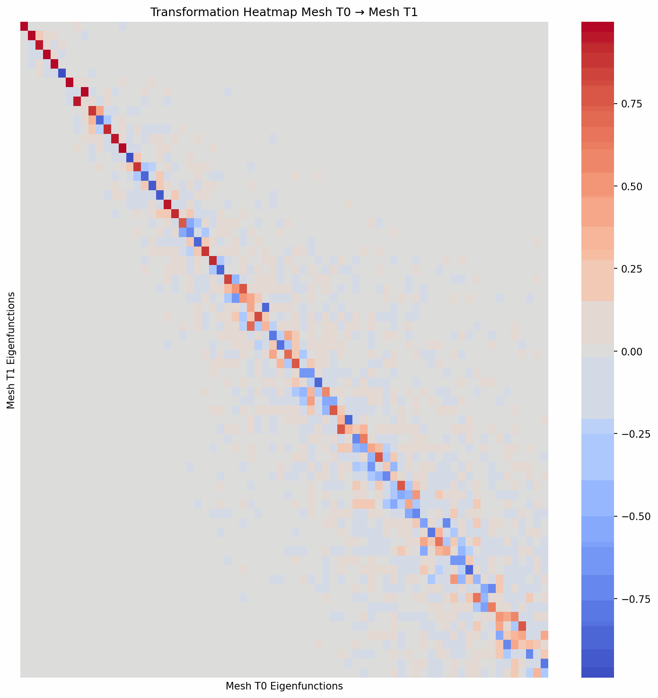
  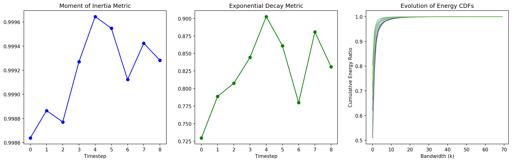
</div>

</details>

<details>
<summary><span style="font-size:21px;">Heatmaps Similarity Metrics</span></summary>

A comparison among $C_{t_{i-1} \to t_{i}}$ vs $C_{t_{i} \to t_{i+1}}$ through the Cross Heatmaps Similarities is provided. This comparison means looking at the derivative of the deformation:

<b>Jensen-Shannon Divergence: </b> 

Treats the squared matrix as an "energy distribution" and measures how much the allocation of energy changes between the two mappings. A spike in JSD indicates a sudden phase shift in the physical deformation. 

For example, if a mesh was smoothly expanding over time, but suddenly starts twisting or turning, the energy distribution across the matrix will dramatically change, and JSD will spike.

<b>Pearson & Spearman Correlation: </b> 

Measures how linearly aligned (Pearson) and structurally ranked (Spearman) the cells of $C_{t_{i-1} \to t_{i}}$ are to $C_{t_{i} \to t_{i+1}}$. 

High correlation means the "nature" or "pattern" of the deformation is steady and consistent. If a mesh is undergoing a continuous, prolonged stretch in one direction over several frames, the FMs will look structurally identical. A drop in correlation means the mesh has started a new, different movement.

<b>Manhattan $L_1$​ and Euclidean $L_2$ Distances: </b>

Measures the raw geometric difference between the specific coefficient values of the two matrices.

This acts as a measure of acceleration or intensity change. If the deformation is speeding up or becoming more drastic between frames, the coordinate distances will increase, even if the general shape of the matrix (the correlation) stays roughly the same.

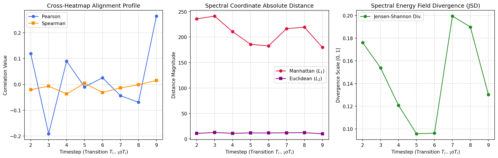

</details>
</details>
</details>

<details>
<summary><strong><span style="font-size:25px;">Reeb Graph</span></strong></summary>

<details>
<summary><span style="font-size:23px;"> Understanding Reeb Graph Construction</span></summary>

The Reeb Graph ($\mathscr{RG}$) is a powerful tool that allows computing a graph representation of a mesh (topology skeleton) using Morse theory (level curves or contour lines of the mesh) $\mathscr{RG}:\mathcal{M} \to \{(V,E),\tau\}$.

Given a real scalar field over the mesh $f:M_{t_{i}} \to \mathbb{R}$ and the following equivalence relation: $x_1,x_2 \in M_{t_{i}}$ are related $x_1 \sim x_2$ if and only if they belong to the same level set: $x_1,x_2 \in f^{-1}(c)$.

Then the Reeb graph is the topological quotient space induced by the relation, endowed with the quotient topology $(M_{t_{i}}/\sim,\tau_{\sim})$.

Even when the definition can be abstract, the idea is very intuitive. Think about the scalar field $f:M_{t_{i}} \to \mathbb{R}$ as the map that tells how to travel through the mesh.

The condition $x_1,x_2 \in f^{-1}(c_i)$ means that $f(x_1)=f(x_2)=c_i$ for a specific value $c_i$. This tells us that on the level $c_i$ of the travel, we need to cut a slice of the surface $M_{t_{i}}$; this is the level curve or contour line of the mesh on the level $c_i$.

Defining the equivalence relation means that we need to look at how many points of the surface $x \in M_{t_{i}}$ on that slice take the value $c_i$, that is $f(x)=c_i$. Then suppose that in that level we have $k$ different points that take this value $\displaystyle x^i_1,...,x^i_k$. Taking the "equivalence relation" means that we are going to think now about all these points as "the same single thing", that is as a single point $\displaystyle v_{c_i} = [c_i] =\{x^i_1,...,x^i_k\}$. This simply means that we are identifying these points with a single vertex on our graph construction.

Saying that the graph has the quotient topology means that the graph captures the topology relationships of the mesh.

The idea is easy to follow graphically: 
<div style="display: flex; gap: 10px; flex-wrap: wrap;">
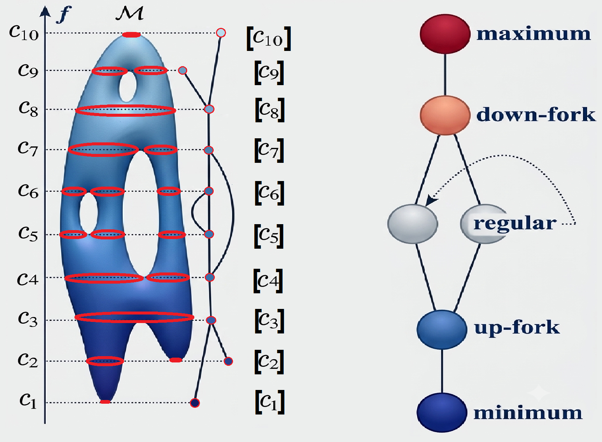
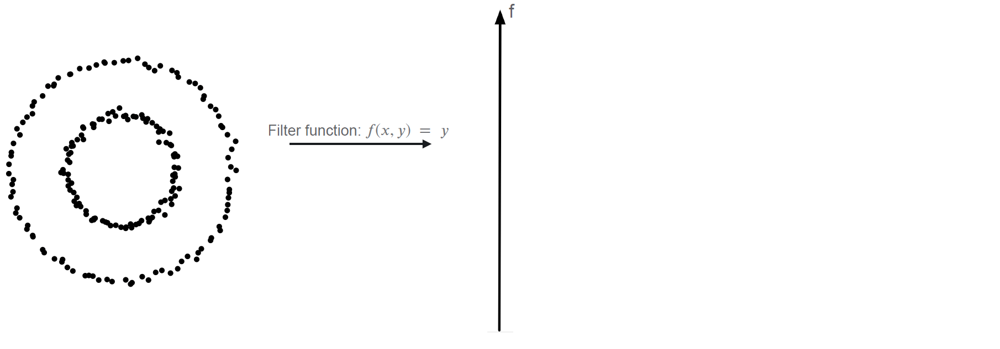
</div>


The full dynamical analysis pipeline can be summarized through the following scheme:


</details>

<details>
<summary><span style="font-size:23px;"> Reeb Graph Usage and Analysis</span></summary>

The computations are executed and managed through the syntax:

```python
from PynamicMesh.core.pipelines import run_pipeline
run_pipeline(**args)
```

In order to compute the Reeb Graph run:

```python
from PynamicMesh.core.pipelines import run_pipeline
run_pipeline(
    path_str='base/path', 
    compute_reeb=True,
    time_graph_analysis=True,
    reeb_scalar="geodesic",
    bins=30,
    **scalar_fields_args 
)
```

Or you can set your parameters on the [yaml](./examples/config.yaml) file, and within the PynamicMesh enviroment run on the comand line:

```python
run_pynamic --config /path/to/the/config.yaml
```

<details>
<summary><span style="font-size:21px;"> Reeb Graph Parameters</span></summary>

Path to the root folder that contains the scenes:
```python 
path_str (str) 
```   

Flag to indicate the model execution:
```
compute_reeb (bool)
```  
Number of level sets used for the graph computing:
```python 
bins (int)
```

Scalar field used to compute the graph:
```python 
reeb_scalar (str)
```

Parameters related to the selection of Scalar Fields `param_name = param_value`:
```python 
**scalar_fields_args (dict)
```

Flag to indicate if the analysis should be run within the loop; this will run the analysis over the raw computed graphs. If you need to run the analysis on the graphs after a modification, you can run it independently over the modified graphs.
```python 
time_graph_analysis (bool)
```

<details>
<summary><span style="font-size:19px;"> Available Scalar Fields</span></summary>

## Spatial Based

<b>$(x,y,z)$-Level sets:</b>  

```python 
reeb_scalar="x" | reeb_scalar="y" | reeb_scalar="z"
```

<b>Distance from the center of mass:</b> 

```python 
reeb_scalar="dist_centroid"
```

<b>Signed distance relative to parallel planes crossing the centroid:</b> 

```python 
reeb_scalar="signed_dist_x" | reeb_scalar="signed_dist_y" | reeb_scalar="signed_dist_z"
```

<b>Absolute distance to specified axis:</b> 

```python 
reeb_scalar="dist_x_axis" | reeb_scalar="dist_y_axis" | reeb_scalar="dist_z_axis" 
```

## Geometric/Topology based

<b>Geometric mean curvature:</b> 

```python  
reeb_scalar="mean_curvature"
```

<b>Gaussian curvature:</b> 

```python 
reeb_scalar="gaussian_curvature"
```

<b>Shape base index:</b> 

```python  
reeb_scalar="shape_index"
```

<b>Curve base index:</b> 

```python  
reeb_scalar="curvedness"
```
 
<b>Protrusion mapping based on mesh $M_{t-1}$:</b> 

```python 
reeb_scalar="normal_displacement"
```

<b>Spectral mapping based on $n$ Laplace-Beltrami eigenfunctions:</b> 

```python 
reeb_scalar="lb_eigen_n" 
```

<b>Multi scalar field maps combination through Mapper Lens construction (PCA feature extraction):</b> 

```python  
reeb_scalar="multi_pca", fields=["f1","f2",..,"fn"] 
```

<b>Spectral mapping based on Heat diffusion, source point (vertex index $i$) $v_i$ and time $t$:</b> 

```python 
reeb_scalar="heat_diffusion", source_idx=i, t=t 
```

<details>
<summary><span style="font-size:17px;"> source_idx options</span></summary>

```python 
source_idx (str|list|int)
t(int) 
```
While the time $t$ remains the same for every mesh of the scene, `source_idx` can codify different options:

Apply the same heat source ($v_n$) for all the meshes:

```python 
source_idx (int): n
```

Apply the heat source $v_i$ for the mesh $M_i$. If $n$ is less than the number of meshes, for the rest the default value `source_idx=0` will be applied:
```python 
source_idx (list): [0,1,2,3,...,n]
```

Apply the heat source $v_i$ for the mesh $M_i$. For the meshes in the None position, the default value `source_idx=0` will be applied:

```python 
source_idx (list): [0,None,None,3,...,n]
```

Visual selection, in the same fashion as in the case of the functional map (see section Landmarks graphical selection for functional maps):

```python 
source_idx (str): "precomputed"
```

</details>

<b>Spectral mapping based on Harmonic with boundary conditions injection flow in vertex $v_i$ and leaving flow in vertex $v_t$: </b> 

```python 
reeb_scalar="harmonic", source_idx=i, sink_idx=t 
```

<details>
<summary><span style="font-size:17px;"> source_idx options</span></summary>

While in the case of `source_idx=i, sink_idx=j` we refer to the boundary conditions injection flow in vertex $v_i$ and leaving flow in vertex $v_j$, `source_idx` can codify different options:

```python 
source_idx (str|list|int)
sink_idx (int) 
```

Use the pair $(i,j)$ as boundary condition $v_i$, $v_j$ for all the meshes.

```python 
source_idx (int)
sink_idx (int) 
```

Use every pair $(i,j)$ in the list as boundary condition $v_i$, $v_j$ `source_idx=i, sink_idx=j` for each mesh. If there are fewer pairs than meshes, for the rest the default value `source_idx=min(index), sink_idx=max(index)` will be applied.

```python 
source_idx (list): [[1,2],[3,4],...,[i,j]]
```

Use every pair $(i,j)$ in the list as boundary condition $v_i$, $v_j$ `source_idx=i, sink_idx=j` for each mesh. For the None positions, the default value `source_idx=min(index), sink_idx=max(index)` will be applied.

```python 
source_idx (list): [[1,2],None,...,[i,j]]
```

Visual selection, in the same fashion as in the case of the functional map (see section Landmarks graphical selection for functional maps).

```python 
source_idx (str): "precomputed"
```
</details>

<b>Geodesic mapping based on vertex landmarks $[v_0,...,v_n] \in M_t$:</b>

```python 
reeb_scalar="geodesic", vertex_ref_index=[0,1,2,n] 
```

<details>
<summary><span style="font-size:17px;"> vertex_ref_index options</span></summary>

The parameter `vertex_ref_index` can codify different options:

```python 
vertex_ref_index (str|list)
```

Apply the set of reference vertices $[v_0,...,v_n]$ for every mesh.

```python 
vertex_ref_index (list): [0,1,2,3,...,n] 
```

Apply each set of reference vertices $[v_0,...,v_n]$ for each mesh. In the case of having fewer reference sets, for the rest the default value `vertex_ref_index=[0]` will be applied.

```python 
vertex_ref_index (list): [[0,...,n1],[0,...,n2],...,[0,...,nk]] 
```

Apply each set of reference vertices $[v_0,...,v_n]$ for each mesh. In the case of None positions, the default value `vertex_ref_index=[0]` will be applied.

```python 
vertex_ref_index (list): [[0,...,n1],None,...,[0,...,nk]]
```

Visual selection, in the same fashion as in the case of the functional map (see section Landmarks graphical selection for functional maps).

```python 
vertex_ref_index (str): "precomputed"
```
</details>

<details>
<summary><span style="font-size:17px;"> Visual reference notes</span></summary>

In each case of the Heat diffusion, Harmonic, and Geodesic based scalar maps, the optional reference point can be selected graphically with the execution of the corresponding code:
```python 
from PynamicMesh.core.custom_fm import visual_selection_edition, precompute_landmarks


################################ Sources Vertex index precompute visual tools for 'heat_diffusion' in Reebs #############################################################
print('Visualizing or editing Sources Vertex index for RG...')
visual_selection_edition(mesh_path,'heat_diffusion')

print('Precomputing Sources Vertex index for RG...')
precompute_landmarks(base_mesh_path,'heat_diffusion')

################################ Source-sink Vertex index precompute visual tools for 'harmonic' in Reebs #############################################################
print('Visualizing or editing Source-sink Vertex index for RG...')
visual_selection_edition(mesh_path,'harmonic')

print('Precomputing Source-sink Vertex index for RG...')
precompute_landmarks(base_mesh_path,'harmonic')

################################# Vertex index reference precompute visual tools for 'geodesic' in Reebs #############################################################
print('Visualizing or editing Vertex index for RG...')
visual_selection_edition(mesh_path,'geodesic')

print('Precomputing Vertex index for RG...')
precompute_landmarks(base_mesh_path,'geodesic') 

```
Each one will generate and save the respective `sources.npy`, `source_sink.npy`, `vert_ref_geo.npy` files within the folder `./PynamicMesh/Results/scene1`.

<b>Note:</b>

If during the pipeline execution the corresponding `'precomputed'` function is used but no `.npy` files are found for a certain folder, the default values will be used.

</details>
</details>
</details>

<details>
<summary><span style="font-size:21px;">Reeb Graph Visualization</span></summary>

After the modeling pipeline execution, the files `Reeb_Ti.pkl` and `Scalar_Ti.npy` (one for each time $t$) will be saved within the folder `./PynamicMesh/Results/scene1/Reeb_Graphs`.

With these files, we can visualize the evolution of the field and the graph over time:

```python 
from PynamicMesh.core.pipelines import run_pipeline
from PynamicMesh.core.reeb_graph import graph_time_analysis, visualize_reeb_graphs

print('Executing modeling ...')
run_pipeline(base_mesh_path, compute_reeb=True, bins=30 , reeb_scalar='geodesic', vertex_ref_index=[4896])

print('Reeb visualizations...') 
visualize_reeb_graphs(mesh_path, reeb_path)
```


</details>

<details>
<summary><span style="font-size:21px;">Reeb Graph Edition Tool</span></summary>

When the graphs are created, we can use the graphical tool to edit the created graph:

- **Click** over an existing vertex (on the graph side) to delete the vertex and all the connected edges to it.
- **Click** on the surface mesh vertex (on the mesh side) to create a vertex, and **click** on an existing graph vertex (on the graph side) to create the edge among them.
- **Press key 'i'** to activate INNER mode; when you click on a vertex, it moves orthogonally into the mesh (press again to deactivate).
- **Press key 'o'** to activate OUTER mode; when you click on a vertex, it moves orthogonally closer to the mesh surface (press again to deactivate mode).
- **Press key 'c'** to activate LINK mode; when you click on two existing vertices on the graph side, the edge among them is created (press again to deactivate mode).
- **Space Bar** to Undo the last change.
- **Use 's' and 'w' keys** to activate/deactivate the visible layer on the mesh.
- **Use the arrow keys** to change the graph in time.

When the edition is ready, just close the window. Only the corresponding modified graphs will be saved.

<b>Note:</b>
The original computed graphs are not overridden. The modified graphs will be stored within the folder `./PynamicMesh/Results/scene1/Reeb_graph_manual_edit`.


</details>

<details>
<summary><span style="font-size:21px;">Time Graph analysis and plotting</span></summary>

When the desired graphs are ready and saved, we can run a temporal analysis and generate the plot of the results and the CSV with the data:

```python 
from PynamicMesh.core.reeb_graph import graph_time_analysis, plot_dynamic_graph_analysis

print('Graph path analysis...')
graph_time_analysis(reeb_path)

print('Plotting dynamic graph analysis...')
plot_dynamic_graph_analysis(csv_file_path)
```

<b>Structural Complexity (Nodes & Edges)</b>

Encodes the raw size of the Reeb graph skeleton. This tracks how "complex" or "branchy" the shape is.

A spike in nodes and edges indicates the mesh is growing new appendages, fragmenting, or wrinkling in time.

A drop indicates the mesh is smoothing out, shrinking, or parts are merging together in time.

<b>The "Intensity" of Deformation (The Distance Metrics)</b>

We calculate three distance metrics (Wasserstein, Spectral Laplacian, and Graph Edit Distance) between consecutive time steps. Together, these act as an "earthquake seismograph" for the meshes.

Encodes how drastically the skeleton shifted from $t_{i-1}$ to $t_i$. 

Smooth, low values mean that the mesh is experiencing stable, continuous deformation (e.g., simply moving or slowly expanding).

Sudden spikes indicate a critical topological event in the system. The mesh just underwent a sudden structural change, such as breaking apart (fission), colliding/merging (fusion), or suddenly collapsing.

The Graph Edit Distance highlights direct physical breakages/additions of branches, while Spectral Distance highlights global warping of the overall shape.

<b>Holes, Loops, and Fusions (Betti-1 Cycles)</b>

The Betti-1 number counts the number of 1D loops or cycles in the graph. It detects when the shape folds back on itself to create a hole or a tunnel (like a donut). 

An increase in cycles means appendages have touched and fused together, creating a closed loop.

<b>Stretching and Elongation (LCC Diameter)</b>

The "Diameter" of the Largest Connected Component represents the longest shortest-path across the graph's skeleton. 
It measures the maximum spatial span of the object. If the diameter steadily increases while the number of nodes stays the same, it means your mesh is being stretched or elongated (like pulling a piece of taffy).

This analysis allows us to automatically pinpoint exactly when and how your 3D meshes undergo major structural changes without having to manually watch the 3D animation. It converts visual shape evolution into a dashboard of growth (size), drastic events (distances), stretching (diameter), and fusions (cycles).

<div style="display: flex; gap: 10px; flex-wrap: wrap; margin-top: 10px;">
  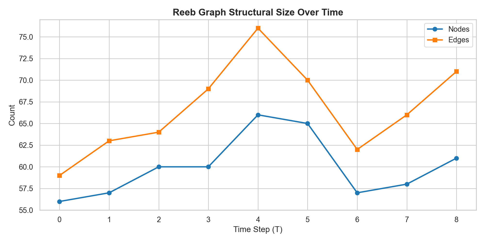
  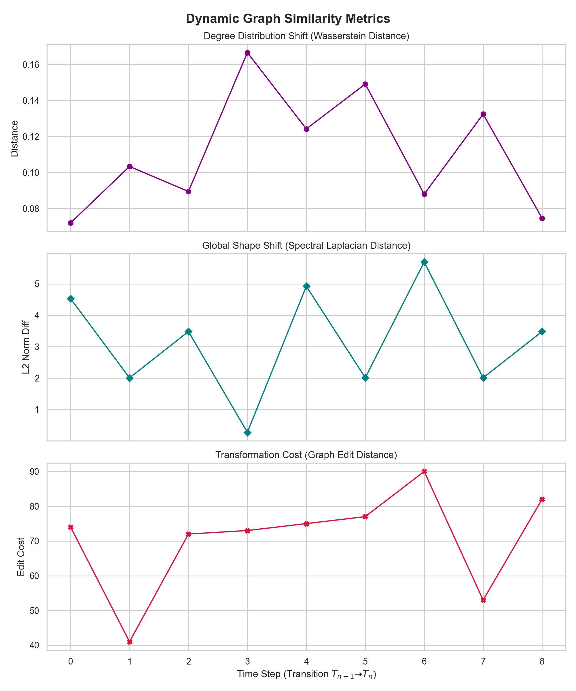
  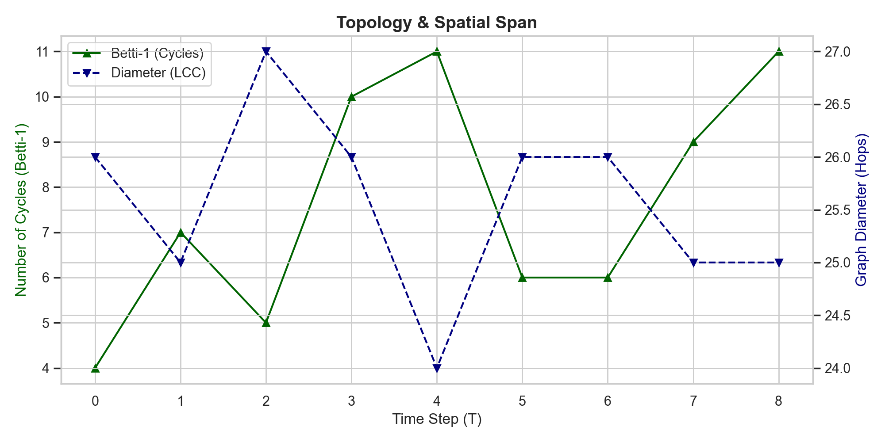
</div>

</details>
</details>
</details>