# PynamicMesh: Dynamic Mesh Modeling & Analysis Tool Box


<p>
  
  
  <a href="https://github.com/RobinMagnet/pyFM">
    
  </a>
  
  
</p>

# How to Install
[Creating a new conda environment](https://docs.conda.io/projects/conda/en/latest/user-guide/tasks/manage-environments.html#creating-an-environment-with-commands) or a [virtual environment](https://docs.python.org/3/library/venv.html) with **Python 3.10+**.

```bash
conda create -y -n PynamicMesh -c conda-forge python=3.11
conda activate PynamicMesh
```

Clone the repo and install dependencies:

```bash
git clone https://github.com/MMV-Lab/PynamicMesh
cd PynamicMesh

# Instalation with only CPU support
pip install .

# Instalation with GPU support depend in your drivers options
pip install ".[gpu-12x]"
pip install ".[gpu-13x]"
pip install ".[rocm-7-0]"

# Instalation with editable mood for developers
pip install -e .
```

# Example Data

All the following examples can be replicated using the [meshes](./examples/Mesh_models/) and the generated example files provided [here](./examples), and all the code usage syntax is summarized in the provided [code](./examples/execution_examples.py).

The provided tools were developed independently into pure computations and visualization/graphical tools in order to keep the flexibility of running the computations on a pure non-graphic node or high-performance computing cluster.

# Project overview

Given a family of meshes $\mathscr{M} = \{ M_{t_i} | 0 \leqslant i \leqslant T \}$ where each mesh $M_{t_i}$ encodes the spatial deformation of the shape at a specific time $t_i$, we deal with a shape deformation that provides a full geometrical encoding of the dynamics related to the deformation.

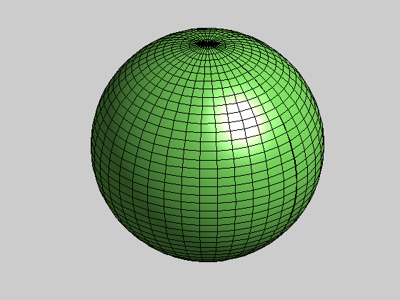

PynamicMesh offers a full general range of pipelines based on Topology, Differential Geometry, and Physics in order to model the complex dynamics encoded in the transformation, allowing the extraction of features that help to characterize and understand the dynamical process.

For a detailed and applied understanding of meshes as Manifolds and triangulations, the following [Jupyter Notebook](https://github.com/JairMathAI/Understanding_Persistent_Homology/blob/main/Persistent_Homology.ipynb) might interest you.

<details>
<summary><strong><span style="font-size:25px;">Global Geometry</span></strong></summary>

This Basic analysis offer a time tracking of the global geometry features of the mesh.

Generating a csv (`features_computed.csv`) with the metric values and the plot of each one (`mesh_evolution_summary.png`) within the folder `./PynamicMesh/Results/scene1/Basic_Geometry/`.

```python
from PynamicMesh.core.pipelines import run_pipeline
run_pipeline(**args)
```

In order to track the Global Geometry, run:

```python
from PynamicMesh.core.pipelines import run_pipeline
run_pipeline(
    path_str='base/path',
    compute_basicGeo = True,
    metrics = 'all',
    plot_basicGeo = True
    )
```

Or you can set your parameters on the [yaml](./examples/config.yaml) file, and within the PynamicMesh enviroment run on the comand line:

```python
run_pynamic --config /path/to/the/config.yaml
```
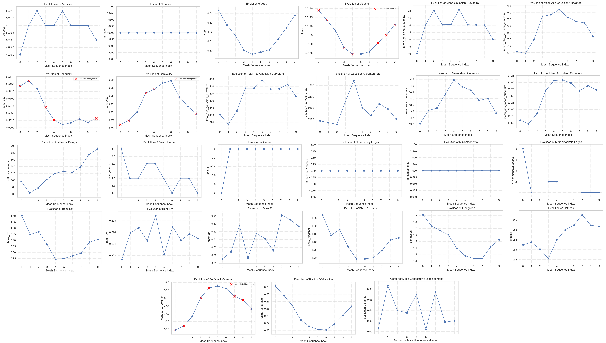

<b>Note:</b>

The volume based metrics (```volume```, ```sphericity```, ```convexity```, ```surface_to_volume```) are always computed with the divergence theorem on the original faces of the mesh, and the column ```is_watertight``` reports whether the mesh is closed and manifold at that time step. When it is not, the values are the approximation for an almost closed surface and the frame is marked with a red cross on the corresponding graphs; use the ```topology``` metrics (```n_boundary_edges```, ```n_components```) to see why. The mesh is never modified before measuring it: welding coincident vertices (as some libraries do by default) turns touching parts of the shape (legs, belly) into non-manifold edges and silently breaks the volume computation of a perfectly closed mesh.

<details>
<summary><span style="font-size:23px;">Global Geometry Parameters</span></summary>

Path to the root folder that contains the scenes:
```python 
path_str (str) 
```   

Flag to indicate the execution:
```python 
compute_basicGeo (bool)
```  

Flag to indicate the plot of the metrics:
```python 
plot_basicGeo (bool)
```

Desired metrics to track:
```python 
metrics (str) | (list)
```
<details>
<summary><span style="font-size:21px;">Available metrics</span></summary>

Compute and report all the available metrics :

```python 
metrics (str) : 'all'
```

Compute just the selected set of metrics :

```python 
metrics (list) : ['n_vertices', 'n_faces', 'area', 'volume', 'sphericity', 'convexity', 'center_mass', 'gaussian_curvature', 'mean_curvature', 'topology', 'bounding_box', 'shape']
```

Some metrics produce several columns in the csv (e.g. ```center_mass``` -> ```cm_x```, ```cm_y```, ```cm_z```); an unknown metric name raises an error instead of being silently ignored.


<b>Mesh Detail:</b>

```n_vertices``` and  ```n_faces```  captures the structural resolution of the mesh (the total number of points and connecting triangles), constant values mean the object is changing shape or moving without altering its basic blueprint. 
Changing values mean the model is actively gaining or losing detail (e.g., tearing, merging, or adaptive rewriting).

<b>Surface Area:</b> 

```area``` captures the total amount of  outside covering for the mesh, tracks stretching and compression. If the surface area spikes while the overall size remains constant, it indicates that the object is wrinkling, crumpling, or becoming highly textured.

<b>Volume:</b> 

```volume```  captures the total relative amount of physical space enclosed inside the object, tracks inflation and deflation. A steady volume means the object is maintaining its physical mass/size while it moves or bends. It comes with the flag ```is_watertight```: ```True``` means the mesh is closed and manifold and the volume is exact; ```False``` means the value is the approximation for an almost closed surface (open boundary or non-manifold edges, see <b>Topology</b>).

<b>Sphericity:</b>

```sphericity``` captures the roundness score from 0 to 1, evaluating how closely the object resembles a perfect ball (1 being a perfect sphere).  A rising score means the object is compacting or pulling itself together into a ball shape. 
A falling score means it is stretching out, flattening, or growing irregular limbs.

<b>Convexity:</b> 

```convexity```  captures a "bulginess" score measuring how many hollows, indents, or valleys the object has.  A high score indicates a smooth, rounded object. A decreasing score means the object is actively folding in on itself, developing deep cavities, or sprouting appendages.

<b>Surface Curvature:</b> 

```gaussian_curvature``` computes the discrete Gaussian curvature at every vertex (angle deficit $K_i = (2\pi - \sum_j \theta_{ij})/A_i$) and reports:

```mean_gaussian_curvature```  the area weighted average texture profile of the surface, distinguishing between dome-like features ($K>0$) and saddle-like curves ($K<0$). For a closed mesh the Gauss-Bonnet theorem fixes it to $4\pi(1-g)/A$, so it mainly tracks the size and the topology of the object.

```mean_abs_gaussian_curvature``` and ```total_abs_gaussian_curvature``` ($\int |K| dA$, scale invariant) serve as global bumpiness trackers: they grow when the smooth skin of the object turns wavy, creased, or sprouts appendages, regardless of the sign of the bumps. ```gaussian_curvature_std``` measures how uneven the texture is over the surface.

```mean_curvature``` computes the discrete mean curvature of every vertex (cotangent formula, $H_i = (Wx)_i \cdot n_i / 2A_i$) and reports ```mean_mean_curvature```, ```mean_abs_mean_curvature``` and the ```willmore_energy``` $\int H^2 dA$, a scale invariant bending energy that equals $4\pi$ for a sphere and grows with every fold, limb or wrinkle of the surface.

<b>Topology:</b> 

```topology``` reports the ```euler_number``` $\chi = V - E + F$, the ```genus``` (number of handles; only defined for closed meshes, `NaN` otherwise), the ```n_boundary_edges``` (0 for a closed surface; holes and tears appear here) and the ```n_components``` (disconnected pieces). Constant values mean the shape deforms without changing its structure; a change flags a topological event (tearing, merging, splitting) or a mesh defect, and explains a ```False``` in ```is_watertight```.

<b>Extent and Shape:</b> 

```bounding_box``` reports the extents ```bbox_dx```, ```bbox_dy```, ```bbox_dz``` and the ```bbox_diagonal``` of the axis aligned bounding box: the overall size of the object in each direction (depends on the orientation of the frames).

```shape``` reports orientation independent shape descriptors from the area weighted principal axes of the surface: ```elongation``` (ratio between the first and second principal extents, 1 for an isotropic object, growing as it stretches along one direction), ```flatness``` (ratio between the second and third principal extents, growing as the object becomes plate-like), ```surface_to_volume``` (skin per unit of enclosed volume, the inverse compactness) and ```radius_of_gyration``` (spread of the surface around its centroid).

<b>Relative Movement Speed:</b>

```center_mass``` captures the straight-line distance traveled by the object's center of gravity from one time frame to the next. Tracks overall speed. A flat line near zero means the object is stationary (even if it is spinning or shaking in place).
Sudden spikes indicate a sudden leap or fast global movement across space. The center of gravity is the volume based center of mass for closed meshes and the area weighted centroid of the surface otherwise.

</details>
</details>
</details>

<details>
<summary><strong><span style="font-size:25px;">Functional Map</span></strong></summary>

<details>
<summary><span style="font-size:23px;">General Overview</strong></summary>

The functional map $(\mathscr{FM})$ allows us to compute a matrix representation $C$ of an unknown transformation function between meshes with whatever amount of vertices and a vector $v$ thar represent the vertex to vertex or the region to region transformation over the mesh.

<div style="display: flex; flex-direction: row; justify-content: center; align-items: center; gap: 10px; flex-wrap: wrap;">
  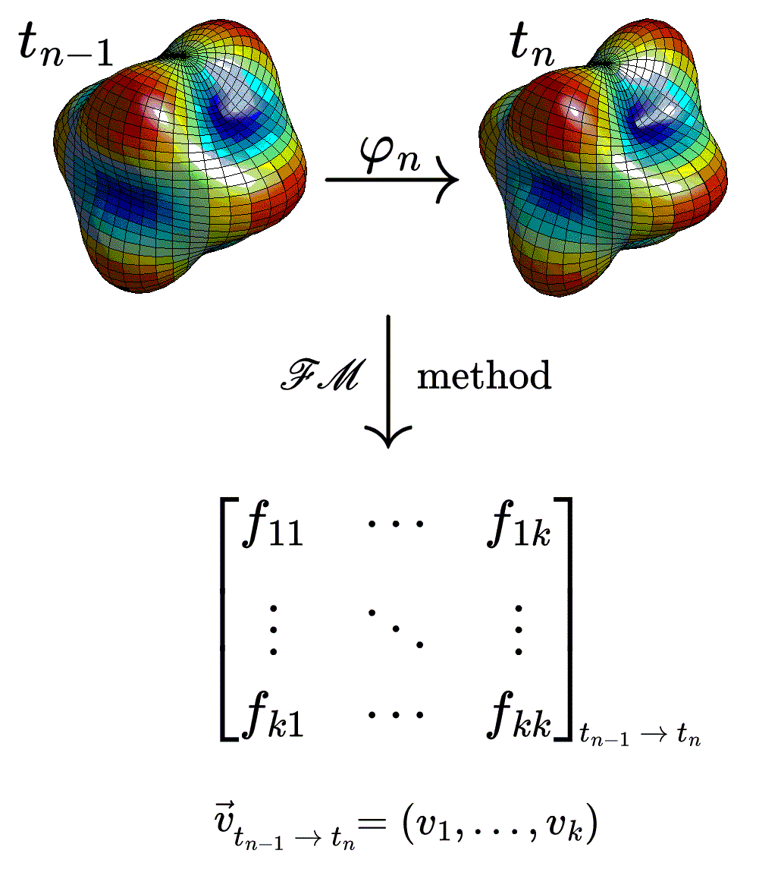
  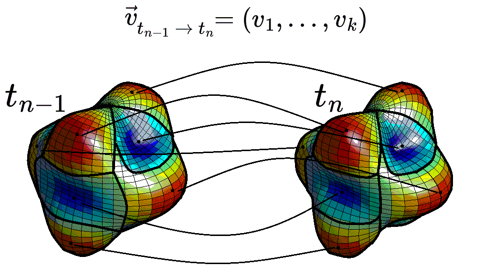
</div>

In order to understand the dynamics of the deformation we can compute this matrix and vector in every time step $t_i$

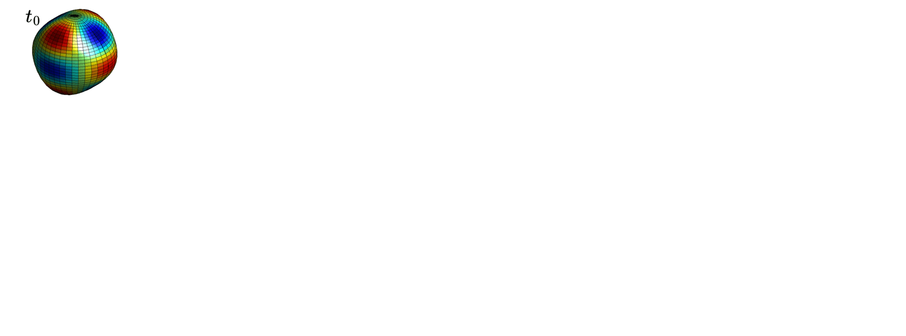

At the end we can use this representations to have a lot of features, those are defined and explained on the correspondig <b>Functional Map Implementation Usage and Analysis</b> section.
</details>

<details>
<summary><span style="font-size:23px;">Mathematical Construction Details</span></summary>

Given two consecutive time step meshes $M_{t_{i-1}}$ and $M_{t_{i}}$, we can think about them in terms of their respective vertices (points) and faces (triangles): $\{\mathcal{V},\mathcal{F}\}_{t_{i-1}}$ and $\{\mathcal{V},\mathcal{F}\}_{t_{i}}$.

The goal is to find a representation of the unknown bijective transformation function $\varphi_n : M_{t_{i-1}} \to M_{t_{i}}$ that describes how the mesh is transformed in space.

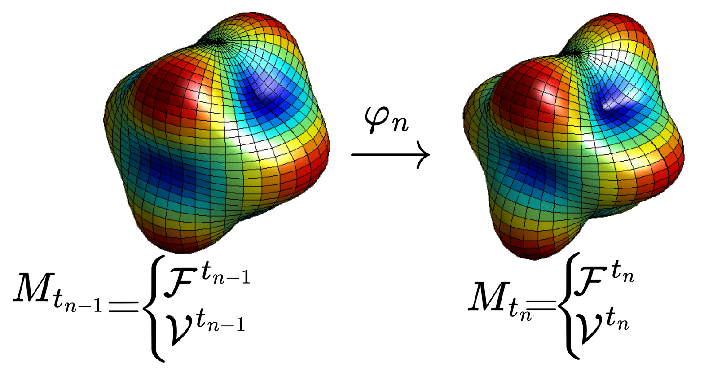

We can use a scalar function defined over each mesh $\psi_{t_{i-1}}: M_{t_{i-1}} \to \mathbb{R}$ and $\psi_{t_i}: M_{t_i} \to \mathbb{R}$ which produces the relation $\psi_{t_i} = \psi_{t_{i-1}} \circ \varphi_n^{-1} = \psi_{t_{i-1}}(\varphi_n^{-1})$.

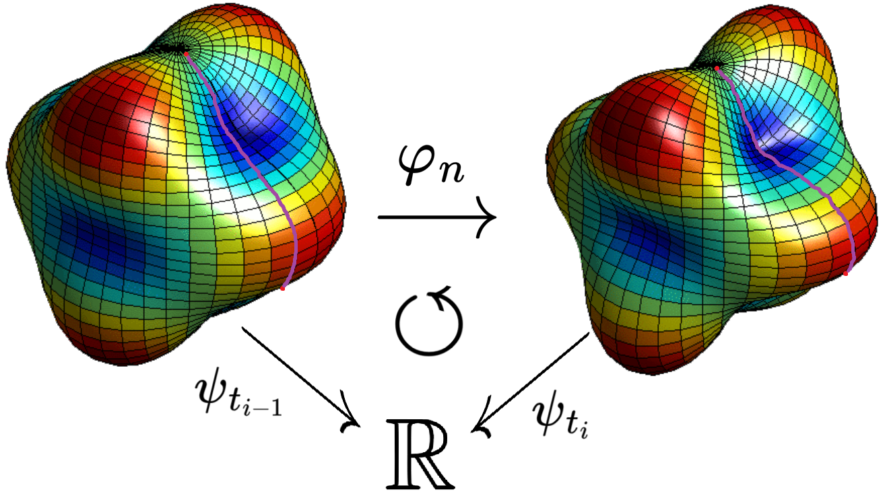

In our case we use as descriptors the point signatures built from the spectrum of the Laplace-Beltrami operator: for a spectral filter $g$ the signature of a point is $\displaystyle S_g(x) = \sum_k g(\lambda_k)\,\phi_k(x)^2$. Three families of filters are available, each evaluated at `n_descr` scales:

<b>WKS</b> (wave kernel, wave propagation function): $g_e(\lambda) \propto \exp\left(-\frac{(e-\log\lambda)^2}{2\sigma^2}\right)$ for log-spaced energies $e$.

<b>HKS</b> (heat kernel, heat diffusion function): $g_t(\lambda) = e^{-t\lambda}$ for log-spaced times $t$.

<b>MKS</b> (Matérn kernel): $g_l(\lambda) = \left(\frac{2\nu}{l^2} + \lambda\right)^{-\left(\nu + \frac{d}{2}\right)}$ with $d=2$, for log-spaced lengthscales $l$.

Where:

$\lambda_k$ represents the eigenvalues of the mesh's Laplace-Beltrami operator.

$l$ is the lengthscale (by default the range is mesh-adaptive, $\left[\sqrt{2\nu/\lambda_{K}},\ \sqrt{2\nu/\lambda_{1}}\right]$, where the filter transitions).

$\nu$ governs the smoothness of the resulting field.

These kernels respect the surface geometry of the shape. Mathematically, they generalize the Laplace-Beltrami operator's spectral properties via the relationship with its eigenvalues. Any weighted sum of these families can be used as descriptor (see <b>Functional Map Parameters</b>), together with two <b>extrinsic</b> families that are aware of the symmetries of the shape (<b>XYZ</b>, <b>NRM</b>; see <b>Symmetry-Aware Mapping</b>).

<div style="display: flex; gap: 10px; flex-wrap: wrap;">
  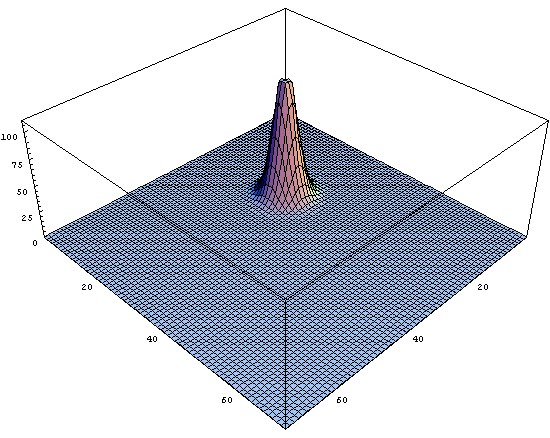
  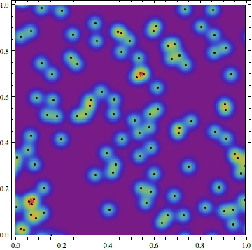
</div>


The composition $\psi_{t_{i-1}}(\varphi_n^{-1})$ induce a linear functional, such that for every function $f:M_{t_{i-1}} \to \mathbb{R}$ we have $\mathcal{F}_{\varphi_n}(f) = f(\varphi_n^{-1})$, so we have the functional transformation $\mathcal{F}_{\varphi_n} : \mathcal{L}(M_{t_{i-1}},\mathbb{R}) \to \mathcal{L}(M_{t_{i}},\mathbb{R})$ where the task to find $\varphi_n$ now means finding a representation for the functional $\mathcal{F}_{\varphi_n}$.

As the linear function spaces $\mathcal{L}(M_{t_{i-1}},\mathbb{R})$ and $\mathcal{L}(M_{t_{i}},\mathbb{R})$ are vector spaces, so they should have a basis of functions $\displaystyle \{\phi_j ^{M_{t_{i-1}}}\}_{j\in J}$ and $\displaystyle \{\phi_k^{M_{t_{i}}}\}_{k\in K}$ so let's find it using the Laplace-Beltrami operator.

If we apply the [ Finite Element Method (FEM)](https://en.wikipedia.org/wiki/Finite_element_method#Discretization) to the Laplace-Beltrami equation of a function $f$ on a triangle mesh $\Delta f = - div( \nabla f)$.

Means that we want to compute the gradient of a function defined on a triangle, but locally the function varies linearly within each triangle $\Delta f = |f(v_j)-f(v_i)|$ . When we integrate the squared gradient over the surface $\displaystyle \frac{1}{2}\sum |f(v_j)-f(v_i)|^2 $, the result simplifies to a weighted sum of the differences between neighboring vertex values.

$$\frac{1}{2}\sum_{ij} w_{ij} [f(v_j)-f(v_i)]$$

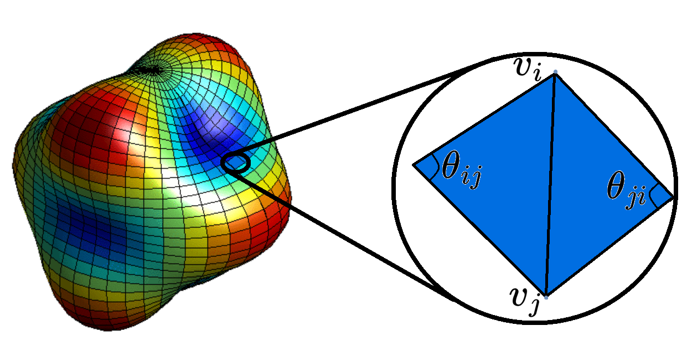

We can contruct the Connectivity matrix or the [Cotan-Laplace operator](https://en.wikipedia.org/wiki/Discrete_Laplace_operator)

The "connectivity" is encoded in the adjacency of the mesh. The Laplacian matrix $L$ is constructed as:

$$L_{ij} = \left\{ \begin{array}{cl}
-w_{ij} & : v_i\to v_j \text{conected}\\
0 & : \text{ no conexion} \\
\end{array} \right.$$

For the diagona the sum of weights of all edges connected to $v_i$

$$ L_{ii} = \sum w_ii $$

This matrix $L$ effectively describes how the Dirichlet energy (heat, or waves) flows from vertex i to its neighbors. Because it is built using the cotangents of the actual angles in the mesh, it is geometry-aware it accounts for the shape and skewness of the triangles, not just the connectivity.

Then for every vertex $v_i$ on the mesh we can compute the Barycentric Area (one-third of the sum of the areas of all triangles T that are connected to that $v_i$) $\displaystyle A_{i} = \frac{1}{2}\sum_{T\in\mathcal{F}(i)} Area(T) $ where $\displaystyle Area(T)=\frac{1}{2}||(v_2-v_1)\times(v_3-v_1)||$ and $(v_3,v_2,v_3)$ are the vertex of a triangle. We can construct the diagonal matrix:

$$W_{ij} = \left\{ \begin{array}{cl}
A_i & : i=j\\
0 & \text{ other case} \\
\end{array} \right.$$

This matrix essentially encode the surface area contribution of each vertex. Because a mesh is made of triangles, the "area" of a vertex is defined by the triangles that share it.

Then we can solve the generalized eigenvalue decomposition for a matrix $\Phi$

$$L\Phi=W\Lambda\Phi$$

Only for the first $k$ eigenvectors we do not compute all the eigenvectors (which would be computationally expensive). Since functional maps typically work on the first $k$ "low-frequency" eigenfunctions (the "spectral footprint").

Once solved, each column $\phi_j$​ of the matrix $\Phi$ contains the values of the $j$-th eigenfunction at every vertex of the mesh.

We can obtain this matrix for the $t_{i-1}$ mesh  $\Phi^{M_{t_{i-1}}}$ and the $t_i$ mesh $\Phi^{M_{t_{i}}}$ to obtain the respective basis from the domain and the codomain of $\varphi_n$.

In theory this basis allows to express our fucntional as a linear combination: 

$$\mathcal{F}_{\varphi_n}(f) = \sum_k\sum_j a_jc_{jk}\phi_k^{M_{t_{i}}}$$

This provide a matrix representation $\mathcal{C}$ determined by the coefficents $c_{jk}$ 

We can express this coeficents using a inner product to project the tranformation represented on the domain base into the codomain base: 

$$\displaystyle c_{jk}= \left\langle \mathcal{F}_{\varphi_n}(\phi_k^{M_{t_{i}}}) , \phi_j ^{M_{t_{i-1}}} \right\rangle$$

But now we have a matrix representation $c_{jk}$ but it depens on $\varphi_n$ which is unknow and to describe $\varphi_n$ somehow we need to find $c_{jk}$

We can use our descriptors in order to get a clue:

Each descriptor function $\Psi_m$ is evaluated on mesh $M_{t_{i-1}}$ and on mesh $M_{t_{i}}$ and projected on the respective basis to obtain the spectral coefficient vectors:

$$ A_m =  \Phi_1^{T} W_1 \Psi_m^{t_{i-1}} \hspace{6mm} B_m =  \Phi_2^{T} W_2 \Psi_m^{t_{i}}  $$

When several descriptor families are combined, every family $j$ is normalized so that the total energy of its functions $\sum_{m\in j}\|\Psi_m\|^2_{L^2(M)}$ equals a weight $w_j$ (the weights are renormalized to sum to one, so ```'WKS+HKS'``` means equal shares and ```'0.7*WKS+0.3*HKS'``` means $70\%/30\%$). The descriptor term is therefore the weighted sum of the energies of the families, and its global balance against the other terms is controlled by $\lambda_{desc}$.

The functional map matrix $\mathcal{F}_{\varphi_n} = C_{t_{i-1} \to t_{i}} \in \mathbb{M}_{k_2 \times k_1}(\mathbb{R})$ that we seek now is given for the one that minimizes the following objective function:

$$
\min_{C} E(C) = \underbrace{\lambda_{desc}\sum_{j} w_j \sum_{m \in j} \| C A_m - B_m \|^2}_{E_{desc}} + \underbrace{\lambda_{reg} \| C \Lambda_1 - \Lambda_2 C \|^2}_{E_{reg}} + \underbrace{\lambda_{comm} \sum_{m} \| C D^{1}_m - D^{2}_m C \|^2}_{E_{comm}} + \underbrace{\lambda_{orient} \sum_{m} \| C G^{1}_m - G^{2}_m C \|^2}_{E_{orient}}
$$

Were:

$A_m, B_m:$ Spectral coefficients of the $m$-th descriptor function on Mesh $t_{i-1}$ and Mesh $t_i$.

$\Lambda_1,\Lambda_2:$ Diagonal matrices of eigenvalues for Mesh $t_{i-1}$ and Mesh $t_i$.

$D^{1}_m, D^{2}_m:$ Multiplicative operators associated with the $m$-th descriptor on each mesh.

$G^{1}_m, G^{2}_m:$ Orientation operators associated with the $m$-th descriptor on each mesh (Ren et al. 2018).

$\lambda_{desc},\lambda_{reg},\lambda_{comm},\lambda_{orient}:$ Scalar weighting parameters to balance the influence of the energy terms (`fit_params`: `w_descr`, `w_lap`, `w_dcomm`, `w_orient`).

$E_{desc} :$ Forces the map to align the chosen descriptors.

$E_{reg}:$ Enforces the spectral consistency (commutativity with the Laplace-Beltrami operator) of the transformation, i.e. a near-isometry.

$E_{comm}:$ Enforces the map to behave like a point-to-point map (commutativity with the descriptor operators).

$E_{orient}:$ Penalizes orientation-reversing maps. A left/right reflection of the shape reverses the orientation of the surface, so this term discards the mirrored solution <b>without any landmark</b> (it is only active when `symmetry_mode` includes `'orientation'`).

<b>Landmarks.</b> A known correspondence $(x_l,y_l)$ between the meshes enters the map through additional <i>landmark-localized descriptors</i>: for the selected spectral filter $g$, $\displaystyle L_l(x) = \sum_k g(\lambda_k)\,\phi_k(x_l)\,\phi_k(x)$ on $M_{t_{i-1}}$ and the analogous function centered at $y_l$ on $M_{t_i}$. These functions peak at the landmark and decay with the geodesic distance to it, so they take different values on the two symmetric halves of the shape and anchor the map (the classical landmark term $E_{land}$ is a particular case of $E_{desc}$).

This optimal matrix $C$ contain the spectral map representation (egenfunction domain). To recover the spatial tranformation vector (vertex domain) $\vec{v}\in \mathbb{N}^k$ where $v_i=j$ describe de correspondance vertex to vertex transformation:

We need to take the basis representation of a point $x_j\in M_{t_{i-1}}$​, which is simply the $j$-th row of $\Phi_1$, denoted $\Phi_1(j, :)$.

And then transform it to the spectral domain of $M_{t_{i}}$: 
$$b_{x_j}=C\Phi_1(j, :)^\top$$

Take the vertex $k$ in $M_{t_{i}}$ that is closest to this transformed representation that is, we perfrom a Nearest Neighbor Search ( For every vertex on the source mesh, you look for the vertex on the target mesh that is "closest" in this spectral embedding space)

$$v_j = \arg \min_{k \in \text{Vertices}(M_{t_{i}})} \| \Phi_2(k, :)^\top - C \Phi_1(j, :)^\top \|^2$$

</details>

<details>
<summary><span style="font-size:23px;">Functional Map Implementation Usage and Analysis</span></summary>

The computations are executed and managed through the syntax:

```python
from PynamicMesh.core.pipelines import run_pipeline
run_pipeline(**args)
```

In order to compute the Functional Map transformations, run:

```python
from PynamicMesh.core.pipelines import run_pipeline
run_pipeline(
    path_str='base/path',
    matrix_tranformation=True,
    diagonal_analysis=True,
    isometric_analysis=True,
    k_eigenfunctions=(10,10),
    k_eigenvalues=100,
    descriptor='0.6*WKS + 0.4*MKS',
    landmarks='auto',
    fm_params={'symmetry_mode': 'landmarks+orientation+extrinsic'},
    compute_physic_fields=True,
)
```

Or you can set your parameters on the [yaml](./examples/config.yaml) file, and within the PynamicMesh enviroment run on the comand line:

```python
run_pynamic --config /path/to/the/config.yaml
```


<details>
<summary><span style="font-size:21px;"> Functional Map Parameters</span></summary>

Path to the root folder that contains the scenes:
```python 
path_str (str) 
```   

Flag to indicate the model execution:
```python 
matrix_tranformation (bool)
```  

Flag to indicate the isometry analysis execution within the loop:
```python 
isometric_analysis (bool)
```

Flag to indicate the diagonal analysis execution within the loop:
```python 
diagonal_analysis (bool)
```

Flag to indicate the computation and storage of the physical fields (once); if it is false, the visualizer will compute them during execution time every time.
```python 
compute_physic_fields (bool)
```
    
Descriptor families used on the pipeline and the share of the descriptor energy assigned to each one: WKS (wave propagation kernel), HKS (heat diffusion kernel), MKS (Matérn kernel), XYZ (aligned coordinates, symmetry-aware) and NRM (surface normals, symmetry-aware). Families are combined with `+`; an optional weight multiplies each family and the weights are renormalized to sum to one (families without weight share the remaining energy). Lists and dictionaries are also accepted.
```python 
descriptor (str|list|dict): 'WKS' | 'HKS' | 'MKS' | 'WKS+HKS+MKS' | '0.7*WKS + 0.3*MKS' | '0.5*WKS + 0.3*MKS + 0.2*XYZ' | {'WKS': 0.7, 'HKS': 0.3}
```

Size of the functional map $C \in \mathbb{M}_{k_2 \times k_1}$ (number of eigenfunctions of each mesh used on the map). An integer $k$ means $(k,k)$:
```python 
k_eigenfunctions (int|tuple) : k | (k1,k2)
```

Number of low frecuence eigenvalues $\lambda_i$ (eigenpairs) computed on each mesh; it must be at least $\max(k_1,k_2)$ plus the ZoomOut growth (the pipeline extends it automatically when needed):

```python 
k_eigenvalues (int) 
```   

Vertex indices indicators for symmetry restriction (see <b>Landmark Options</b>):
```python 
landmarks (None|str|list): None | 'precomputed' | 'auto' | [...]
```

Dictionary with the advanced options of the map (symmetry handling, automatic landmarks, descriptor and optimization parameters). Every key is optional:
```python 
fm_params (dict)
```

<details>
<summary><span style="font-size:19px;">fm_params keys</span></summary>

Symmetry handling strategy; several strategies can be combined with `+` (see <b>Symmetry-Aware Mapping</b>):
```python 
fm_params['symmetry_mode'] (str): 'none' | 'landmarks' | 'orientation' | 'extrinsic' | 'landmarks+orientation+extrinsic'
```

Number of spectral filters (scales) per descriptor family, and column subsampling of the point-signature blocks (recommended `3-5` when landmarks are used, since each landmark adds `n_descr` columns):
```python 
fm_params['n_descr'] (int) : 100
fm_params['subsample_step'] (int) : 1
```

Options of the automatic landmark selection and of the landmark block (see <b>Landmark Options</b>):
```python 
fm_params['landmark_params'] (dict)
```

Descriptor options:
```python 
fm_params['descr_params'] (dict)
```

`nu` (float, `1.5`): Smoothness parameter of the Matérn kernel. Lower values (e.g., $\nu = 0.5$) correspond to an Exponential kernel and create a rougher, highly localized field that responds aggressively to fine geometric fluctuations. Higher values (e.g., $\nu = 2.5$ or higher) smooth out noise; use them if the input meshes have sensor noise or surface artifacts to ignore.

`min_l`, `max_l` (float, `None`): Spatial bounds of the geometric features captured by the Matérn kernel. The min should be small enough to capture fine-grained local parts and the max should approach the bounding box diameter of the shape to capture global posture configurations. By default the range is mesh-adaptive $\left[\sqrt{2\nu/\lambda_K},\ \sqrt{2\nu/\lambda_1}\right]$.

`k_smooth` (int, `30`): Number of Laplace-Beltrami eigenfunctions used to low-pass filter the extrinsic descriptors XYZ and NRM.

`xyz_weight` (float, `0.3`): Energy share of the XYZ block added automatically by `symmetry_mode='extrinsic'`.

Weights of the energy terms of the objective function (see <b>Mathematical Construction Details</b>):
```python 
fm_params['fit_params'] (dict) : {'w_descr': 1e-1, 'w_lap': 1e-3, 'w_dcomm': 1.0, 'w_orient': 1.0}
```

Map refinement: `'auto'` selects the ZoomOut parameters from the meshes, `'icp'` uses ICP refinement, and a tuple `(nit, step)` fixes the ZoomOut iterations and step:
```python 
fm_params['refine'] (str|tuple) : 'auto' | 'icp' | (nit, step)
```

Time step between consecutive meshes, used to report velocities and accelerations in the physical fields:
```python 
fm_params['dt'] (float) : 1.0
```

Print the descriptor plan and the landmarks kept for every pair of meshes:
```python 
fm_params['verbose'] (bool) : False
```
</details>

<details>
<summary><span style="font-size:19px;">Landmark Options</span></summary>

No symmetry restrictions applied:   
```python 
landmarks : None
``` 
A priori known indices of the $n$ symmetrical vertices (when the same works for all transformations):
```python
landmarks (list) : [1,2,3,4,..,n] -> (n,)
``` 

A priori known indices of the symmetrical vertices (one per considered transformation). If the list contains fewer sets of vertices than the pairs of meshes, the remaining computations will perform without restrictions.
```python 
landmarks (list) : [[1,..,n1],..,[1,..,nk]] -> (n,m)
``` 

A priori known pair indices of the symmetrical vertices; here $[j,k]$ means that the $v_j$ vertex of the mesh $M_{t_{i-1}}$ is related to the $v_k$ vertex of the mesh $M_{t_i}$ (the same pair applied to every transformation).
```python 
landmarks (list) : [[1,2],...,[j,k]] -> (2,n)
``` 

A priori known pair indices of the symmetrical vertices (one set of relations considered per transformation). If the list contains fewer sets of vertex relations than the pairs of meshes, the remaining computations will perform without restrictions.
```python 
landmarks (list) : [[[1,2],...,[j,k]],...,[[1,2],...,[l,m]]]] -> (m,2,n)
```

<b>Note:</b>

The independent function `precompute_landmarks(root_path,'FM')` can be used along with the graphical tool to click over the vertex selection for every scene in the project. Alternatively, the function `visual_selection_edition(path_to_meshes,'FM')` is included to precompute or edit existing landmarks for a specific scene. Both functions will generate a `landmark.npy` file with the corresponding selected vertex relations, and this option will check for this precomputed `.npy` file during execution.

```python 
landmarks (str) : 'precomputed'
``` 

<b>Automatic landmarks.</b> A robust set of landmarks is selected for every pair of consecutive meshes without any manual intervention:

```python 
landmarks (str) : 'auto'
``` 

1. Geodesic farthest-point sampling on $M_{t_{i-1}}$ produces `n_landmarks` well spread candidates, starting from the extremities (legs, head, tail), which are exactly the points that disambiguate the symmetries.
2. Each candidate is matched on $M_{t_i}$: with `'hybrid'` the best match in descriptor space among the vertices within a spatial radius of the landmark (the frames of a sequence are aligned), with `'extrinsic'` the nearest vertex in space, and with `'identity'` the same vertex index (meshes sharing the connectivity).
3. Unreliable pairs are rejected: displacement larger than `max_rel_dist` times the bounding-box diagonal, duplicated targets, and pairs that break the geodesic-distance consistency between landmarks by more than `max_distortion` (relative, removed iteratively worst-first). If fewer than `min_landmarks` pairs survive, the pair of meshes is processed without landmarks (a warning is issued).

The landmarks actually used are stored as `landmarks_T0000_T0001.npy` (one `(m,2)` array per transformation) within the folder `./PynamicMesh/Results/scene1/Landmarks/`. The selection is controlled with:

```python 
fm_params['landmark_params'] (dict) : {
    'n_landmarks': 12,          # farthest-point samples on M_{t-1}
    'match': 'hybrid',          # 'hybrid' | 'extrinsic' | 'identity'
    'max_rel_dist': 0.15,       # max displacement (fraction of the bounding-box diagonal)
    'max_distortion': 0.25,     # max relative geodesic distortion between landmarks
    'min_landmarks': 4,         # minimum surviving pairs to use landmarks
    'search_rel_radius': 0.10,  # spatial search radius for 'hybrid' (fraction of the diagonal)
    'weight': 1.0,              # energy of the landmark block relative to the point-signature blocks
    'descriptor': 'WKS',        # spectral filter localized at the landmarks (default: first spectral family)
}
```

The keys `weight` and `descriptor` also apply to explicit and `'precomputed'` landmarks. Setting `symmetry_mode='landmarks'` with `landmarks=None` is equivalent to `landmarks='auto'`.
</details>
</details>

<details>
<summary><span style="font-size:21px;">Symmetry-Aware Mapping</span></summary>

Intrinsic descriptors (WKS, HKS, MKS) are invariant under the intrinsic symmetries of a shape: if a body has a left/right isometry, the two front legs have identical signatures, and the map is determined only up to that symmetry. No purely intrinsic point descriptor can break such a symmetry, so three complementary mechanisms are provided and selected with `fm_params['symmetry_mode']` (combinable with `+`):

<b>Landmarks</b> ```'landmarks'``` : landmark-localized descriptors anchored at known or automatically selected correspondences (see <b>Landmark Options</b>).

<b>Orientation term</b> ```'orientation'``` : adds $E_{orient}$ to the objective. A reflection reverses the orientation of the surface, so the mirrored map is penalized without any landmark. It cannot distinguish orientation-preserving near-isometries (e.g. a $180^\circ$ rotation of a body of revolution), so it is best used as a complement of the other two.

<b>Extrinsic descriptors</b> ```'extrinsic'``` : adds the aligned coordinates of the vertices (family `XYZ`, low-pass filtered with `k_smooth` eigenfunctions) as a descriptor block with energy `xyz_weight`. Because consecutive frames of a sequence are spatially aligned (`load_aligned_mesh`) and the motion between them is small with respect to the distance between symmetric parts, the coordinates take different values on the two halves of the shape and anchor the map. The surface normals (family `NRM`) play the same role and both families can be written directly in the descriptor string with their own weights, e.g. ```descriptor='0.5*WKS + 0.3*MKS + 0.2*XYZ'```.

Typical configurations:

```python
# a) baseline: no landmarks, intrinsic descriptors only (symmetric flips possible)
run_pipeline(base_mesh_path, matrix_tranformation=True, descriptor='WKS+HKS+MKS', landmarks=None,
             fm_params={'symmetry_mode': 'none'})

# b) precomputed (manually selected) landmarks only
run_pipeline(base_mesh_path, matrix_tranformation=True, descriptor='WKS+HKS+MKS', landmarks='precomputed',
             fm_params={'symmetry_mode': 'landmarks'})

# c) automatic landmarks only
run_pipeline(base_mesh_path, matrix_tranformation=True, descriptor='WKS+HKS+MKS', landmarks='auto',
             fm_params={'symmetry_mode': 'landmarks', 'landmark_params': {'n_landmarks': 12}})

# d) symmetry-aware descriptors only, no landmarks
run_pipeline(base_mesh_path, matrix_tranformation=True, descriptor='0.6*WKS + 0.4*MKS', landmarks=None,
             fm_params={'symmetry_mode': 'orientation+extrinsic'})

# recommended default for sequences with bilateral symmetry
run_pipeline(base_mesh_path, matrix_tranformation=True, descriptor='0.6*WKS + 0.4*MKS', landmarks='auto',
             fm_params={'symmetry_mode': 'landmarks+orientation+extrinsic', 'subsample_step': 4})
```

<b>Note:</b>
The `extrinsic` and `landmarks` mechanisms rely on the alignment of the frames; if the meshes of a sequence are not aligned (or the motion between frames is comparable to the size of the symmetric parts), use `'precomputed'` landmarks.

</details>

<details>
<summary><span style="font-size:21px;">Landmarks Graphical Selection</span></summary>

For the precomputed landmarks:

```python
from PynamicMesh.utils.visualizers import precompute_landmarks

precompute_landmarks("./PynamicMesh/Mesh_models",'FM')
```

Vertices are chosen by clicking over them and unmarked by clicking again over the selected vertex. When the selection is ready, just close the window in order to pass to the next mesh and the pipeline is the same.

The vertex selection should be performed in the same order for each mesh so the right related pairs are formed. The selected vertices should roughly correspond to the same related regions of the meshes.

At the end, the `.npy` file with our vertex selection on each frame will be stored in the path `./PynamicMesh/Results/scene1/landmark.npy`.


If we use the other function:

```python
from PynamicMesh.utils.visualizers import visual_selection_edition

visual_selection_edition("./PynamicMesh/Mesh_models/scene1",'FM',source='auto')
```

Where :
```python
source (str): 'legacy' / 'auto' # for the .npy file of manualy selection / for the automatically generate files under Results/Scene/Landmarks
```


The visualizer is going to show the specific mesh dynamics and the landmarks created previously, giving the chance to edit them or also create them if they do not exist.

In this case, in order to change among meshes in time, use the arrow keys on the keyboard. When the edition is finished, just close the window and it will be stored. 

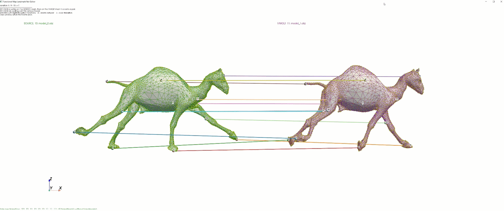

</details>

<details>
<summary><span style="font-size:21px;"> Physical Features and Map Transformation Models </span></summary>

We can run our matrix transformation computing; at the end of the run, the pipeline will save one matrix per transformation (`FMC_T0000_T0001.npy`, $C_{t_0 \to t_1}$) and the corresponding vector of vertex transformations (`FMV_T0001_T0000.npy`; the entry $j$ is the vertex of $M_{t_0}$ matched to the vertex $j$ of $M_{t_1}$) within the folder `./PynamicMesh/Results/scene1/Transform_Matrices/`. The indices are zero padded so that the files sort in time order.

Let's run first the pipeline without landmarks to see the results.

```python
from PynamicMesh.core.pipelines import run_pipeline
run_pipeline(base_mesh_path, matrix_tranformation=True, descriptor='WKS+HKS', landmarks=None, k_eigenfunctions=(10,10),k_eigenvalues=100)
```

Compute the physical fields and visualize them with:

```python
from PynamicMesh.utils.visualizers import visualize_physics
visualize_physics("./PynamicMesh/Mesh_models/scene1", "./PynamicMesh/Results/scene1/Transform_Matrices/", on_time=False)
```

The parameter `on_time` indicates if it needs to compute the physical field during execution or just look for the precomputed and stored results created during `run_pipeline` (`compute_physic_fields=True`).
```python
on_time(bool)
```

The fields are stored as one `frame_0000.npz`, `frame_0001.npz`, ... file per time step (the vertices, faces and every field listed below) together with the CSV `global_physical_metrics.csv` of integrated quantities, within the folder `./PynamicMesh/Results/scene1/Physical_fields/`. The meshes are loaded with the same aligned loader used for the maps, so the fields do not include the rigid alignment of the frames.

The viewer organizes the fields in two pages: <b>Up/Down</b> (or <b>p</b>) switch the page and <b>Left/Right</b> step the frames. The first frame is the reference frame, where all the fields are trivial by construction (zero strains, unit stretches). Colour ranges are common to all frames (robust percentiles), so the animation is comparable in time.

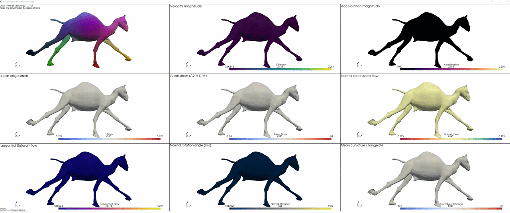

All the fields are computed per vertex of $M_{t_i}$ from the point-to-point map: the displacement $\vec{d}_j = \vec{v}^{\,t_i}_j - \vec{v}^{\,t_{i-1}}_{p2p(j)}$ and, for the deformation measures, the triangles of $M_{t_i}$ pulled back to $M_{t_{i-1}}$ through the map (reference configuration). Elements whose reference triangle collapses (two vertices matched to the same source vertex) are excluded from the averages instead of producing spurious infinite strains; their fraction is reported in the global metrics.

<b>Page 1: Kinematics & classic strains</b>

<b>$\Delta$-Color transfer</b>: 

Showing with different colors which region of the mesh $M_{t_{i-1}}$ is transformed into which over the mesh $M_{t_{i}}$. The panel also reports the global metrics of the transition.

<b>$\Delta\vec{v}$ Vertex velocity displacement</b> (`velocity`): 

Showing the map over the mesh about the velocity ratios of change with respect to the vertex mapping (euclidean velocity of displacement) $||\vec{d}_j||/\Delta t$; that means coloring the regions of faster change.

<b>Acceleration</b> (`acceleration`): 

Change of the displacement of the <i>same material point</i> between two consecutive transitions, $||\vec{d}^{\,t_i}_j - \vec{d}^{\,t_{i-1}}_{p2p(j)}||/\Delta t^2$. Highlights the regions where the motion starts, stops or changes direction (zero for a uniform motion).

<b>Linear (edge) strain</b> (`strain`): 

Plot the result of the finite elements pipeline to compute the zones of stretch and compression with respect to the edges (1D), $\varepsilon = (l_{t_i} - l_{t_{i-1}})/l_{t_{i-1}}$ averaged on the vertices, that is where the coefficient $\varepsilon > 0 \to$ stretch edges and $\varepsilon < 0 \to$ contraction edges.

<b>Area (Face) strain</b> (`area_strain`): 

Plot the result of the finite elements pipeline to compute the zones of stretch and compression with respect to the faces (2D), $\varepsilon_A = (A_{t_i} - A_{t_{i-1}})/A_{t_{i-1}}$, that is where the coefficient $\varepsilon_A > 0 \to$ stretch areas and $\varepsilon_A < 0 \to$ contraction areas.

<b>Normal protrusion flow $\vec{v}|| \vec{N}$</b> (`normal_flow`): 

Signed component of the displacement along the vertex normal of $M_{t_i}$, $\vec{d}_j \cdot \vec{N}_j$. That is the "outward" or "inward" direction relative to the surface (areas where the mesh is actively pushing out or pulling in).

<b>Tangent flow $\vec{v} \hookrightarrow \vec{T}$</b> (`tangential_flow`): 

Subtracts the normal component from the total displacement to isolate the lateral movement, $||\vec{d}_j - (\vec{d}_j \cdot \vec{N}_j)\vec{N}_j||$, representing the lateral or crawling flow across the surface. This captures how the mesh material slides or shifts across the surface without necessarily changing the local thickness or volume.

<b>Normal rotation</b> (`normal_rotation`): 

Angle (radians) between the normal of a vertex of $M_{t_i}$ and the normal of its matched vertex on $M_{t_{i-1}}$, $\arccos(\vec{N}^{\,t_i}_j \cdot \vec{N}^{\,t_{i-1}}_{p2p(j)})$. Isolates bending and twisting of the surface from its translation.

<b>Mean curvature change</b> (`curvature_change`): 

$\Delta H_j = H^{t_i}_j - H^{t_{i-1}}_{p2p(j)}$, with the discrete mean curvature obtained from the cotangent Laplacian. Positive values mean the surface is becoming more convex at that point, negative values more concave (flexural deformation).

<b>Page 2: Continuum mechanics (deformation gradient)</b>

For every triangle the deformation gradient $F$ maps the reference triangle (on $M_{t_{i-1}}$, through the map) onto the deformed one (on $M_{t_i}$). The right Cauchy-Green tensor $\mathbf{C} = F^{T}F$ has eigenvalues $\lambda_1^2 \geqslant \lambda_2^2$, the squared <b>principal stretches</b>; the Green-Lagrange strain is $\mathbf{E} = \frac{1}{2}(\mathbf{C} - I)$. The per-triangle quantities are averaged on the vertices weighted by the reference area.

<b>Principal stretches</b> (`stretch_max`, `stretch_min`): 

$\lambda_1$ and $\lambda_2$; a value of $1$ means no deformation along the corresponding principal direction, $>1$ elongation and $<1$ compression. Unlike the edge strain, they separate the two independent directions of the in-plane deformation.

<b>Green-Lagrange principal strains</b> (`principal_strain_max`, `principal_strain_min`): 

$\varepsilon_i = \frac{1}{2}(\lambda_i^2 - 1)$, the finite-strain counterpart of the linear strain (exact for large deformations).

<b>Shear anisotropy</b> (`shear_anisotropy`): 

$\log(\lambda_1/\lambda_2)$; zero for a pure dilation (isotropic growth or shrinkage) and growing with the amount of shearing. Distinguishes regions that change size from regions that change shape.

<b>Maximum shear strain</b> (`max_shear_strain`): 

$\frac{1}{2}(\varepsilon_1 - \varepsilon_2)$, the largest shear strain over all in-plane directions.

<b>Elastic energy density</b> (`elastic_energy_density`): 

$(\lambda_1 - 1)^2 + (\lambda_2 - 1)^2$ (As-Rigid-As-Possible / Saint-Venant-type energy per unit reference area). Highlights where the deformation departs from a rigid motion; its integral over the surface is reported as the total elastic energy of the transition.

<b>Area ratio and dilatation</b> (`area_ratio`, `dilatation_log`): 

$\lambda_1\lambda_2 = A_{t_i}/A_{t_{i-1}}$ and its logarithm, which is symmetric for growth and shrinkage ($\log 2$ for a doubling, $-\log 2$ for a halving).

<b>Global metrics</b> (`global_physical_metrics.csv`, one row per transition $t_{i-1} \to t_i$):

`area_ratio` and `volume_ratio` (total surface area and enclosed volume of $M_{t_i}$ relative to $M_{t_{i-1}}$; the volume is meaningful for closed meshes), `mean_speed` (area-weighted) and `max_speed`, `total_elastic_energy` and `mean_elastic_energy_density`, `mean_abs_strain`, `mean_abs_area_strain`, `mean_shear_anisotropy`, `mean_normal_flow`, `mean_tangential_flow`, `mean_normal_rotation_deg`, `mean_abs_curvature_change`, and two quality indicators of the map: `p2p_injectivity` (fraction of the vertices of $M_{t_{i-1}}$ reached by the map; $1$ for a bijection) and `collapsed_faces_fraction` (triangles excluded from the deformation measures). A drop of the injectivity or a rise of the collapsed fraction flags a transition where the functional map (and hence the physical fields) should not be trusted.

<b>Plote</b>
The Physical feature analysis provide automatically a plot profile based on it and storage the resulrs under `./Results/scene/Physical_fields/Plots`.

This plots can be independly generated 

```python
from PynamicMesh.core.physic_model import plot_global_physical_metrics
plot_global_physical_metrics('Path\to\global_physical_metrics.csv')
```

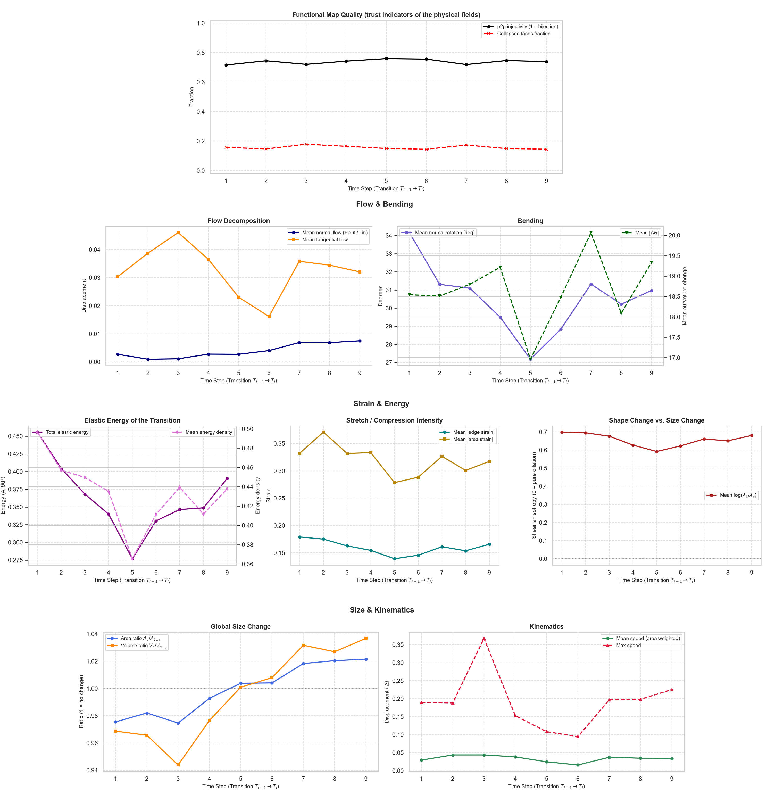

<b>Note:</b>

The Camel is almost symmetric by the middle; due to this, the $\Delta$-Color transfer shows that the Functional mapping captures well the transformation of the front legs—that is, during all times $t$, the right front leg is blue and the left front leg is purple. But in the case of the hind legs, we can see that in the transitions $t_0 \to t_1$ and $t_6 \to t_7$, the legs and the half hind body swap colors. This is because the intrinsic descriptors can't capture the symmetries, meaning that our matrix representation is not correct there. However, using our landmarks (or the landmark-free strategies of <b>Symmetry-Aware Mapping</b>) we can see that this error is corrected. We can run:

The precomputed landmarks are provided [here](./examples/landmarks.npy).

```python
from PynamicMesh.core.pipelines import run_pipeline
from PynamicMesh.utils.visualizers import visualize_physics

run_pipeline(base_mesh_path, matrix_tranformation=True, descriptor='WKS+HKS', landmarks='precomputed', k_eigenfunctions=(10,10),k_eigenvalues=100)
visualize_physics("./PynamicMesh/Mesh_models/scene1", "./PynamicMesh/Results/scene1/Transform_Matrices/", on_time=False)
```

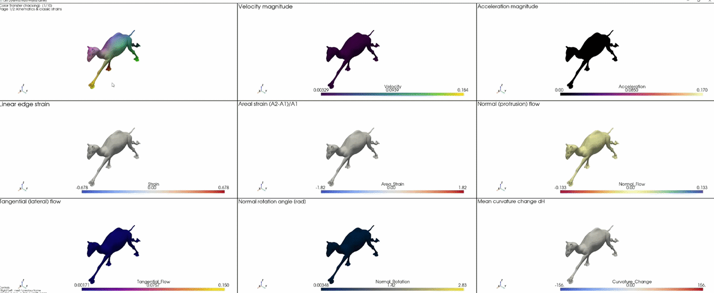

The same correction is obtained without any manual selection with `landmarks='auto'` or with `fm_params={'symmetry_mode': 'orientation+extrinsic'}`.

</details>

<details>
<summary><span style="font-size:21px;">Isometry Transformation Tracking</span></summary>

Beside the animations and computations, within the folder (`./PynamicMesh/Results/scene1/Diagonal_analysis`) the Heatmap of the matrix representation in each time step will be reported. This heatmap $C_{t_{i-1} \to t_{i}}$ codifies the nature of the transformation: if the heatmap is diagonal, the transformation is close to an isometry (the topology remains intact and the transformation is a rotation or shift); if the values of the heatmap are sparse (far from the diagonal), it means that the topology underwent significant deformations during the transformation.

In our camel example, changes to the topology are not too aggressive (mostly just the legs changing positions), so the matrices stay close to the diagonal. In order to track the diagonality of the heatmaps over time, we track three metrics and report the results in a CSV file:

<b>Moment of Inertia Metric: </b> 

$$MI(C_{t_{i-1} \to t_i}) = 1 - \frac{\sum_{i,j}|i - j|^2\, c_{ij}^2}{d_{\max}^2 \sum_{i,j} c_{ij}^2}$$

where $d_{\max} = \max(k_1,k_2) - 1$ is the largest possible distance to the diagonal, which represents $1 - \text{inertia}$ of the energy distribution $c_{ij}^2$.

If $MI(C_{t_{i-1} \to t_i}) \to 1$, the energy is concentrated directly on or immediately next to the main diagonal.

If $MI(C_{t_{i-1} \to t_i}) \to 0$, it indicates energy has escaped to the upper or lower corners of the matrix.

<b>Note:</b>
This metric is highly sensitive to far-away outliers, meaning even a small amount of energy in the far corners will cause this metric to drop significantly.

<b>Exponential Decay Metric: </b> 

$$ED(C_{t_{i-1} \to t_i}) = \frac{\sum_{i,j} c_{ij}^2\, e^{-0.5|i-j|}}{\sum_{i,j} c_{ij}^2}$$

If $ED(C_{t_{i-1} \to t_{i}}) \to 1$, it confirms that the energy is resting inside a tight, focused band along the diagonal.

If $ED(C_{t_{i-1} \to t_{i}}) \to 0$, it indicates a highly diffused, blurry, or scattered functional map where the diagonal is poorly preserved.

<b>Cumulative Distribution Function Bandwidth: </b>

The function loops through every possible bandwidth radius $k$ (from 0 up to the maximum dimension of the matrix). At each step, it accumulates the percentage of total energy contained within a diagonal band of thickness $k$: 

$$CDF(C_{t_{i-1} \to t_i}, k) = \frac{\sum_{|i-j| \leqslant k} c_{ij}^2}{\sum_{i,j} c_{ij}^2}$$

Exact percentage of total energy sitting directly on the core main diagonal line.

If the plotted curve shoots up vertically and hits 1.0 at a very low bandwidth ($k=2$ or $3$), the matrix is tightly bounded around the diagonal.

If the curve scales up gradually as a slow diagonal line, it indicates that the spectral energy is leaking into wide off-diagonal frequencies.

<div style="display: flex; gap: 10px; flex-wrap: wrap;">
  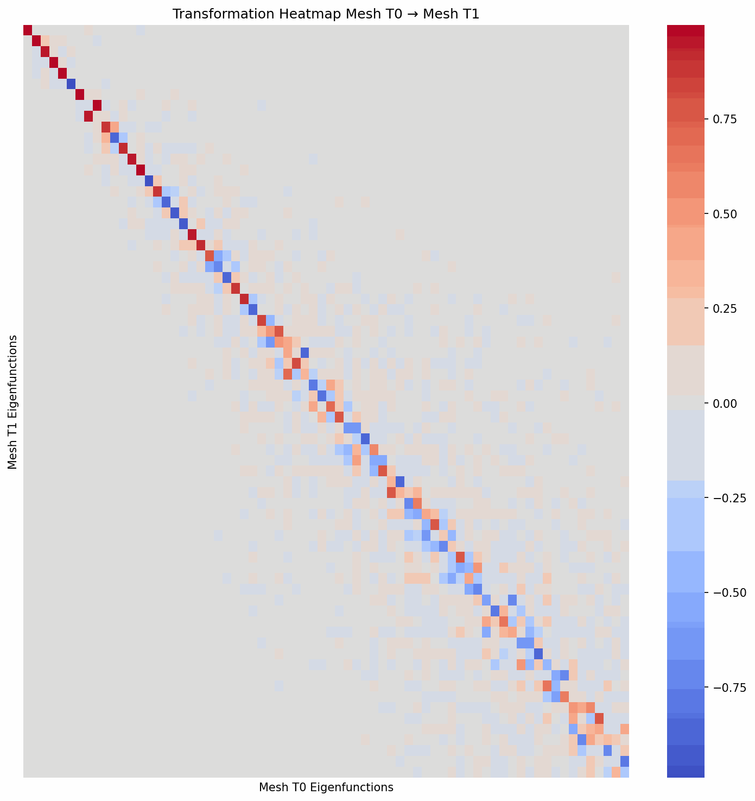
  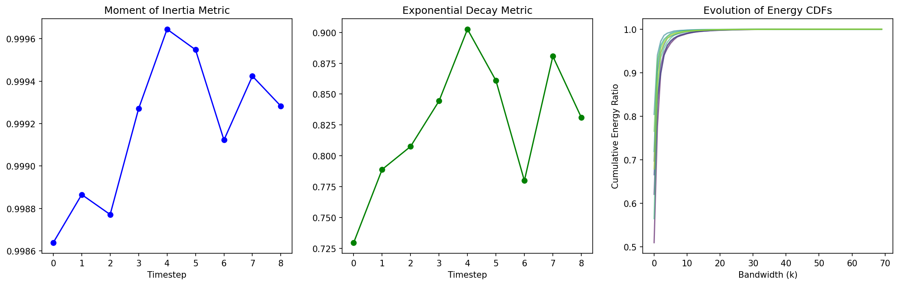
</div>

</details>

<details>
<summary><span style="font-size:21px;">Heatmaps Similarity Metrics</span></summary>

A comparison among $C_{t_{i-1} \to t_{i}}$ vs $C_{t_{i} \to t_{i+1}}$ through the Cross Heatmaps Similarities is provided. This comparison means looking at the derivative of the deformation:

<b>Jensen-Shannon Divergence: </b> 

Treats the squared matrix as an "energy distribution" and measures how much the allocation of energy changes between the two mappings (base-2 logarithm, so the value lies in $[0,1]$). A spike in JSD indicates a sudden phase shift in the physical deformation. When the ZoomOut refinement produces maps of different sizes, the common top-left block is compared. 

For example, if a mesh was smoothly expanding over time, but suddenly starts twisting or turning, the energy distribution across the matrix will dramatically change, and JSD will spike.

<b>Pearson & Spearman Correlation: </b> 

Measures how linearly aligned (Pearson) and structurally ranked (Spearman) the cells of $C_{t_{i-1} \to t_{i}}$ are to $C_{t_{i} \to t_{i+1}}$. 

High correlation means the "nature" or "pattern" of the deformation is steady and consistent. If a mesh is undergoing a continuous, prolonged stretch in one direction over several frames, the FMs will look structurally identical. A drop in correlation means the mesh has started a new, different movement.

<b>Manhattan $L_1$​ and Euclidean $L_2$ Distances: </b>

Measures the raw geometric difference between the specific coefficient values of the two matrices.

This acts as a measure of acceleration or intensity change. If the deformation is speeding up or becoming more drastic between frames, the coordinate distances will increase, even if the general shape of the matrix (the correlation) stays roughly the same.

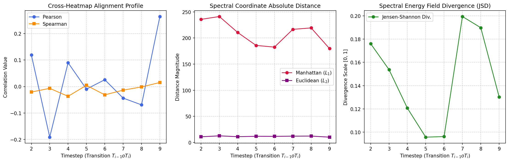

</details>
</details>
</details>

<details>
<summary><strong><span style="font-size:25px;">Reeb Graph</span></strong></summary>

<details>
<summary><span style="font-size:23px;">General Overview</span></summary>

The Reeb Graph ($\mathscr{RG}$) is a powerful tool that allows computing a graph representation of a mesh (topology skeleton) using Morse theory (level curves or contour lines of the mesh).

This is possible by assigning a vertex in the graph to each level curve, which generates a graph based on the local geometric structures.

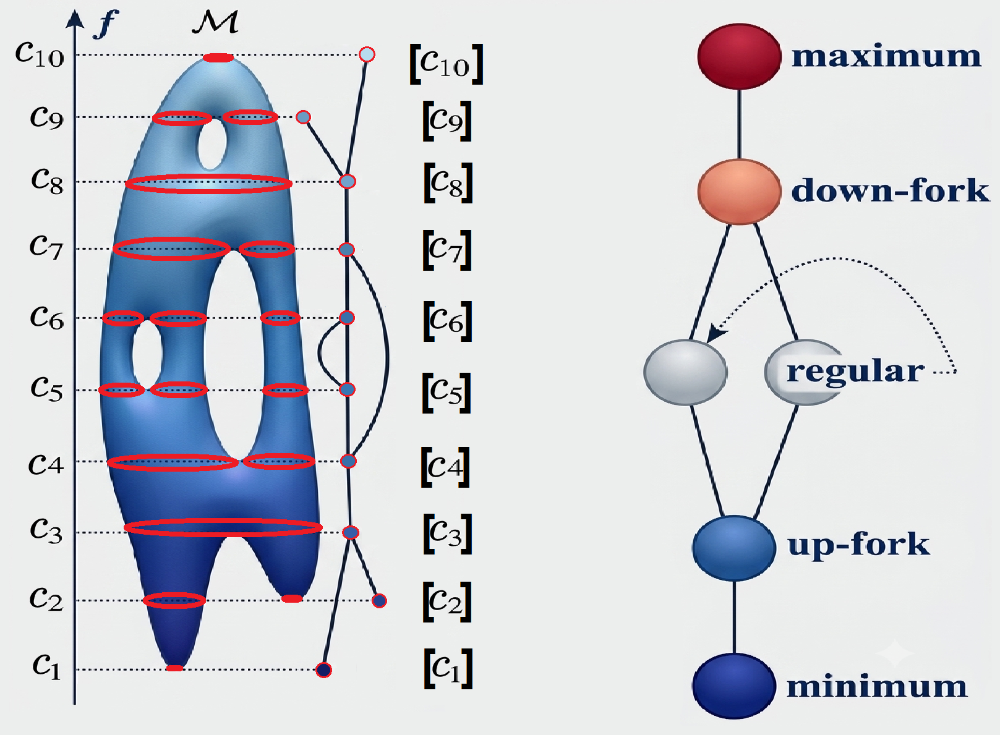

In order to understand the dynamics of the deformation we can compute this graophs in every time step $t_i$


At the end we can use this representations to have a lot of features, those are defined and explained on the correspondig <b>Reeb Graph Usage and Analysis</b> section


</details>

<details>
<summary><span style="font-size:23px;">Mathematical Construction Details</span></summary>

Given a real scalar field over the mesh $f:M_{t_{i}} \to \mathbb{R}$ and the following equivalence relation: $x_1,x_2 \in M_{t_{i}}$ are related $x_1 \sim x_2$ if and only if they belong to the same level set: $x_1,x_2 \in f^{-1}(c)$.

Then the Reeb graph is the topological quotient space induced by the relation, endowed with the quotient topology $(M_{t_{i}}/\sim,\tau_{\sim})$.

Even when the definition can be abstract, the idea is very intuitive. Think about the scalar field $f:M_{t_{i}} \to \mathbb{R}$ as the map that tells how to travel through the mesh.

The condition $x_1,x_2 \in f^{-1}(c_i)$ means that $f(x_1)=f(x_2)=c_i$ for a specific value $c_i$. This tells us that on the level $c_i$ of the travel, we need to cut a slice of the surface $M_{t_{i}}$; this is the level curve or contour line of the mesh on the level $c_i$.

Defining the equivalence relation means that we need to look at how many points of the surface $x \in M_{t_{i}}$ on that slice take the value $c_i$, that is $f(x)=c_i$. Then suppose that in that level we have $k$ different points that take this value $\displaystyle x^i_1,...,x^i_k$. Taking the "equivalence relation" means that we are going to think now about all these points as "the same single thing", that is as a single point $\displaystyle v_{c_i} = [c_i] =\{x^i_1,...,x^i_k\}$. This simply means that we are identifying these points with a single vertex on our graph construction.

Saying that the graph has the quotient topology means that the graph captures the topology relationships of the mesh.

The idea is easy to follow graphically: 

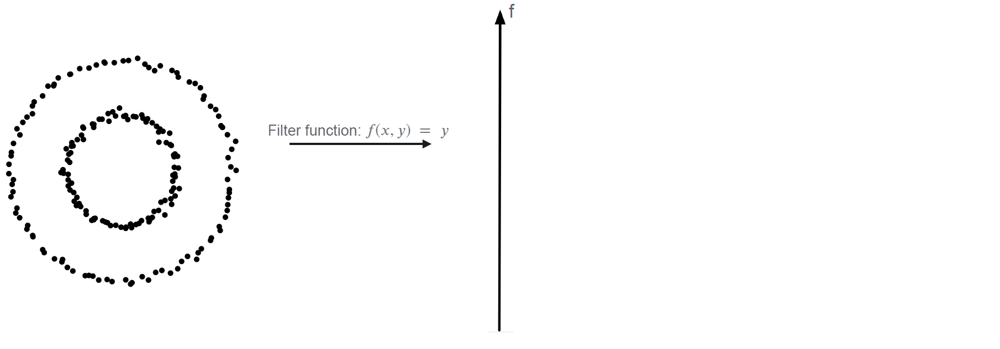

</details>

<details>
<summary><span style="font-size:23px;"> Reeb Graph Usage and Analysis</span></summary>

The computations are executed and managed through the syntax:

```python
from PynamicMesh.core.pipelines import run_pipeline
run_pipeline(**args)
```

In order to compute the Reeb Graph run:

```python
from PynamicMesh.core.pipelines import run_pipeline
run_pipeline(
    path_str='base/path', 
    compute_reeb=True,
    time_graph_analysis=True,
    reeb_scalar="geodesic",
    bins=30,
    **scalar_fields_args 
)
```

Or you can set your parameters on the [yaml](./examples/config.yaml) file, and within the PynamicMesh enviroment run on the comand line:

```python
run_pynamic --config /path/to/the/config.yaml
```

<details>
<summary><span style="font-size:21px;"> Reeb Graph Parameters</span></summary>

Path to the root folder that contains the scenes:
```python 
path_str (str) 
```   

Flag to indicate the model execution:
```
compute_reeb (bool)
```  
Number of level sets used for the graph computing:
```python 
bins (int)
```

Scalar field used to compute the graph:
```python 
reeb_scalar (str)
```

Parameters related to the selection of Scalar Fields `param_name = param_value`:
```python 
**scalar_fields_args (dict)
```

Two options are common to every scalar field. `equalize_histogram` replaces the field by its normalized rank in $[0,1]$: the Reeb graph only depends on the ordering of the field, so the graph is unchanged, but the level sets become equally populated and the node levels comparable among frames (default `True` for `heat_diffusion` and `matern_kernel`, `False` otherwise). `geodesic_solver` selects the geodesic solver for `geodesic` and `mass_center_geodesic`: `'heat'` (heat method, with an automatic fallback to Dijkstra when it fails) or `'dijkstra'` (exact on the edge graph, stable among frames):
```python 
equalize_histogram (bool)
geodesic_solver (str) : 'heat' | 'dijkstra'
```

Flag to indicate if the analysis should be run within the loop; this will run the analysis over the raw computed graphs. If you need to run the analysis on the graphs after a modification, you can run it independently over the modified graphs.
```python 
time_graph_analysis (bool)
```

<details>
<summary><span style="font-size:19px;"> Available Scalar Fields</span></summary>

## Spatial Based

<b>$(x,y,z)$-Level sets:</b>  

```python 
reeb_scalar="x" | reeb_scalar="y" | reeb_scalar="z"
```

<b>Distance from the center of mass:</b> 

```python 
reeb_scalar="dist_centroid"
```

<b>Signed distance relative to parallel planes crossing the centroid:</b> 

```python 
reeb_scalar="signed_dist_x" | reeb_scalar="signed_dist_y" | reeb_scalar="signed_dist_z"
```

<b>Absolute distance to specified axis:</b> 

```python 
reeb_scalar="dist_x_axis" | reeb_scalar="dist_y_axis" | reeb_scalar="dist_z_axis" 
```

## Geometric/Topology based

<b>Geometric mean curvature:</b> 

```python  
reeb_scalar="mean_curvature"
```

<b>Gaussian curvature:</b> 

```python 
reeb_scalar="gaussian_curvature"
```

<b>Shape base index:</b> 

```python  
reeb_scalar="shape_index"
```

<b>Curve base index:</b> 

```python  
reeb_scalar="curvedness"
```
 
<b>Protrusion mapping based on mesh $M_{t-1}$:</b> 

```python 
reeb_scalar="normal_displacement"
```

<b>Spectral mapping based on $n$ Laplace-Beltrami eigenfunctions:</b> 

```python 
reeb_scalar="lb_eigen_n" 
```

<b>Geodesic path to the center of mass:</b> 

```python 
reeb_scalar="mass_center_geodesic"
```

<b>Multi scalar field maps combination through Mapper Lens construction (PCA feature extraction):</b> 

```python  
reeb_scalar="multi_pca", fields=["f1","f2",..,"fn"] 
```

<b>Matérn Kernel:</b> 

Apply Matérn Kernel where:

Smoothness Parameter ```nu```  Controls how "differentiable" the kernel surface is.

Lower values (e.g., $nu = 0.5$): Corresponds to an Exponential kernel. It creates a rougher, highly localized field that responds aggressively to fine geometric fluctuations.
Higher values (e.g., $nu = 2.5$ or higher): Smooths out noise. Use higher values if your input 3D scans have sensor noise or surface artifacts you want to ignore.

A singular landmark ```source_idx``` on the mesh is selected as the source point. The Matérn kernel measures how strongly information "diffuses" or correlates from that source point out to every other vertex.

The ```lengthscale``` referst to the spatial bounds of the geometric features to capture.

A small lengthscale isolates the scalar field strictly around your source vertex.
A large lengthscale allows the correlation field to gracefully cascade over the entire body structure, giving the Reeb graph a more stable structural backbone.

```python 
reeb_scalar="matern_kernel" , nu=0.15, source_idx=i, lengthscale=1.0  
```
<details>
<summary><span style="font-size:17px;"> source_idx options</span></summary>

```python 
source_idx (str|list|int)
```
```source_idx``` can codify different options:

Apply the same source point ($v_n$) for all the meshes:

```python 
source_idx (int): n
```

Apply the mesh mass center $(x,y,z)$ for all the meshes:

```python 
source_idx (str): 'mass_center'
```

Apply the source point $v_i$ for the mesh $M_i$. If $n$ is less than the number of meshes, for the rest the default value `source_idx=0` will be applied:
```python 
source_idx (list): [0,1,2,3,...,n]
```

Apply the source point $v_i$ for the mesh $M_i$. For the meshes in the None position, the default value `source_idx=0` will be applied:

```python 
source_idx (list): [0,None,None,3,...,n]
```

Visual selection, in the same fashion as in the case of the functional map (see section Landmarks graphical selection for functional maps):

```python 
source_idx (str): "precomputed"
```

</details>

<b>Spectral mapping based on Heat diffusion, source point (vertex index $i$) $v_i$ and time $t$:</b> 

```python 
reeb_scalar="heat_diffusion", source_idx=i, t='auto' 
```

<details>
<summary><span style="font-size:17px;"> source_idx options</span></summary>

```python 
source_idx (str|list|int)
t (float|str) : 'auto'
```
The diffusion time is not scale independent: a fixed value gives an almost constant field on meshes with small eigenvalues and a Dirac-like field on meshes with large ones. `t='auto'` (default) selects $t = 1/\sqrt{\lambda_1\lambda_K}$, the geometric mean of the resolvable diffusion times; a numeric $t$ is applied as given and remains the same for every mesh of the scene. `source_idx` can codify different options (a list of several indices for the same mesh yields the heat emitted by all of them):

Apply the same heat source ($v_n$) for all the meshes:

```python 
source_idx (int): n
```
Apply the mesh mass center $(x,y,z)$ for all the meshes:

```python 
source_idx (str): 'mass_center'
```

Apply the heat source $v_i$ for the mesh $M_i$. If $n$ is less than the number of meshes, for the rest the default value `source_idx=0` will be applied:
```python 
source_idx (list): [0,1,2,3,...,n]
```

Apply the heat source $v_i$ for the mesh $M_i$. For the meshes in the None position, the default value `source_idx=0` will be applied:

```python 
source_idx (list): [0,None,None,3,...,n]
```

Visual selection, in the same fashion as in the case of the functional map (see section Landmarks graphical selection for functional maps):

```python 
source_idx (str): "precomputed"
```

</details>

<b>Spectral mapping based on Harmonic with boundary conditions injection flow in vertex $v_i$ and leaving flow in vertex $v_t$: </b> 

```python 
reeb_scalar="harmonic", source_idx=i, sink_idx=t 
```

<details>
<summary><span style="font-size:17px;"> source_idx options</span></summary>

While in the case of `source_idx=i, sink_idx=j` we refer to the boundary conditions injection flow in vertex $v_i$ and leaving flow in vertex $v_j$, `source_idx` can codify different options:

```python 
source_idx (str|list|int)
sink_idx (int) 
```

Use the pair $(i,j)$ as boundary condition $v_i$, $v_j$ for all the meshes.

```python 
source_idx (int)
sink_idx (int) 
```

Use every pair $(i,j)$ in the list as boundary condition $v_i$, $v_j$ `source_idx=i, sink_idx=j` for each mesh. If there are fewer pairs than meshes, for the rest the default value `source_idx=min(index), sink_idx=max(index)` will be applied.

```python 
source_idx (list): [[1,2],[3,4],...,[i,j]]
```

Use every pair $(i,j)$ in the list as boundary condition $v_i$, $v_j$ `source_idx=i, sink_idx=j` for each mesh. For the None positions, the default value `source_idx=min(index), sink_idx=max(index)` will be applied.

```python 
source_idx (list): [[1,2],None,...,[i,j]]
```

Visual selection, in the same fashion as in the case of the functional map (see section Landmarks graphical selection for functional maps).

```python 
source_idx (str): "precomputed"
```
</details>

<b>Geodesic mapping based on vertex landmarks $[v_0,...,v_n] \in M_t$:</b>

```python 
reeb_scalar="geodesic", vertex_ref_index=[0,1,2,n] 
```

<details>
<summary><span style="font-size:17px;"> vertex_ref_index options</span></summary>

The parameter `vertex_ref_index` can codify different options:

```python 
vertex_ref_index (str|list)
```
Apply the mesh mass center $(x,y,z)$ for all the meshes:

```python 
vertex_ref_index (str): 'mass_center'
```

Apply the set of reference vertices $[v_0,...,v_n]$ for every mesh.

```python 
vertex_ref_index (list): [0,1,2,3,...,n] 
```

Apply each set of reference vertices $[v_0,...,v_n]$ for each mesh. In the case of having fewer reference sets, for the rest the default value `vertex_ref_index=[0]` will be applied.

```python 
vertex_ref_index (list): [[0,...,n1],[0,...,n2],...,[0,...,nk]] 
```

Apply each set of reference vertices $[v_0,...,v_n]$ for each mesh. In the case of None positions, the default value `vertex_ref_index=[0]` will be applied.

```python 
vertex_ref_index (list): [[0,...,n1],None,...,[0,...,nk]]
```

Visual selection, in the same fashion as in the case of the functional map (see section Landmarks graphical selection for functional maps).

```python 
vertex_ref_index (str): "precomputed"
```
</details>

<details>
<summary><span style="font-size:17px;"> Visual reference notes</span></summary>

In each case of the Heat diffusion, Harmonic, and Geodesic based scalar maps, the optional reference point can be selected graphically with the execution of the corresponding code:
```python 
from PynamicMesh.utils.visualizers import visual_selection_edition, precompute_landmarks


################################ Sources Vertex index precompute visual tools for 'heat_diffusion' in Reebs #############################################################
print('Visualizing or editing Sources Vertex index for RG...')
visual_selection_edition(mesh_path,'heat_diffusion')

print('Precomputing Sources Vertex index for RG...')
precompute_landmarks(base_mesh_path,'heat_diffusion')

################################ Source-sink Vertex index precompute visual tools for 'harmonic' in Reebs #############################################################
print('Visualizing or editing Source-sink Vertex index for RG...')
visual_selection_edition(mesh_path,'harmonic')

print('Precomputing Source-sink Vertex index for RG...')
precompute_landmarks(base_mesh_path,'harmonic')

################################# Vertex index reference precompute visual tools for 'geodesic' in Reebs #############################################################
print('Visualizing or editing Vertex index for RG...')
visual_selection_edition(mesh_path,'geodesic')

print('Precomputing Vertex index for RG...')
precompute_landmarks(base_mesh_path,'geodesic') 

```
Each one will generate and save the respective `sources.npy`, `source_sink.npy`, `vert_ref_geo.npy` files within the folder `./PynamicMesh/Results/scene1`.

<b>Note:</b>

If during the pipeline execution the corresponding `'precomputed'` function is used but no `.npy` files are found for a certain folder, the default values will be used.

</details>
</details>
</details>

<details>
<summary><span style="font-size:21px;">Reeb Graph Visualization</span></summary>

After the modeling pipeline execution, the files `Reeb_T0000.pkl` and `Scalar_T0000.npy` (one for each time $t$, zero padded) will be saved within the folder `./PynamicMesh/Results/scene1/Reeb_Graphs`. Every node of the graph stores its position `pos`, its level set `bin` and level value `f_value`, and the mesh vertices it represents (`n_vertices`, `vertices`); the viewer colours the nodes by their level with the same colour map as the scalar field.

With these files, we can visualize the evolution of the field and the graph over time:

```python 
from PynamicMesh.core.pipelines import run_pipeline
from PynamicMesh.core.reeb_graph import graph_time_analysis
from PynamicMesh.utils.visualizers import  visualize_reeb_graphs

print('Executing modeling ...')
run_pipeline(base_mesh_path, compute_reeb=True, bins=30 , reeb_scalar='geodesic', vertex_ref_index=[4896])

print('Reeb visualizations...') 
visualize_reeb_graphs(mesh_path, reeb_path)
```

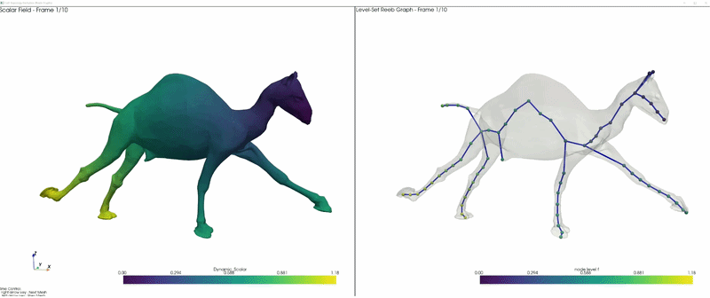

</details>

<details>
<summary><span style="font-size:21px;">Reeb Graph Edition Tool</span></summary>

When the graphs are created, we can use the graphical tool to edit the created graph:

- **Click** over an existing vertex (on the graph side) to delete the vertex and all the connected edges to it.
- **Click** on the surface mesh vertex (on the mesh side) to create a vertex, and **click** on an existing graph vertex (on the graph side) to create the edge among them.
- **Press key 'i'** to activate INNER mode; when you click on a vertex, it moves orthogonally into the mesh (press again to deactivate).
- **Press key 'o'** to activate OUTER mode; when you click on a vertex, it moves orthogonally closer to the mesh surface (press again to deactivate mode).
- **Press key 'c'** to activate LINK mode; when you click on two existing vertices on the graph side, the edge among them is created (press again to deactivate mode).
- **Space Bar** to Undo the last change.
- **Use 's' and 'w' keys** to activate/deactivate the visible layer on the mesh.
- **Use the arrow keys** to change the graph in time.

When the edition is ready, just close the window. Only the corresponding modified graphs will be saved.

<b>Note:</b>
The original computed graphs are not overridden. The modified graphs will be stored within the folder `./PynamicMesh/Results/scene1/Reeb_graph_manual_edit`.


</details>

<details>
<summary><span style="font-size:21px;">Time Graph Analysis</span></summary>

When the desired graphs are ready and saved, we can run a temporal analysis and generate the plot of the results and the CSV with the data:

```python 
from PynamicMesh.core.reeb_graph import graph_time_analysis, plot_dynamic_graph_analysis

print('Graph path analysis...')
graph_time_analysis(reeb_path)

print('Plotting dynamic graph analysis...')
plot_dynamic_graph_analysis(csv_file_path)
```

<b>Structural Complexity (Nodes & Edges)</b>

Encodes the raw size of the Reeb graph skeleton. This tracks how "complex" or "branchy" the shape is.

A spike in nodes and edges indicates the mesh is growing new appendages, fragmenting, or wrinkling in time.

A drop indicates the mesh is smoothing out, shrinking, or parts are merging together in time.

<b>The "Intensity" of Deformation (The Distance Metrics)</b>

We calculate three distance metrics (Wasserstein, Spectral Laplacian, and Graph Edit Distance) between consecutive time steps. Together, these act as an "earthquake seismograph" for the meshes.

Encodes how drastically the skeleton shifted from $t_{i-1}$ to $t_i$. 

Smooth, low values mean that the mesh is experiencing stable, continuous deformation (e.g., simply moving or slowly expanding).

Sudden spikes indicate a critical topological event in the system. The mesh just underwent a sudden structural change, such as breaking apart (fission), colliding/merging (fusion), or suddenly collapsing.

The Graph Edit Distance highlights direct physical breakages/additions of branches, while Spectral Distance highlights global warping of the overall shape.

<b>Holes, Loops, and Fusions (Betti-1 Cycles)</b>

The Betti-1 number counts the number of 1D loops or cycles in the graph. It detects when the shape folds back on itself to create a hole or a tunnel (like a donut). 

An increase in cycles means appendages have touched and fused together, creating a closed loop.

<b>Stretching and Elongation (LCC Diameter)</b>

The "Diameter" of the Largest Connected Component represents the longest shortest-path across the graph's skeleton. 
It measures the maximum spatial span of the object. If the diameter steadily increases while the number of nodes stays the same, it means your mesh is being stretched or elongated (like pulling a piece of taffy).

This analysis allows us to automatically pinpoint exactly when and how your 3D meshes undergo major structural changes without having to manually watch the 3D animation. It converts visual shape evolution into a dashboard of growth (size), drastic events (distances), stretching (diameter), and fusions (cycles).

<div style="display: flex; gap: 10px; flex-wrap: wrap; margin-top: 10px;">
  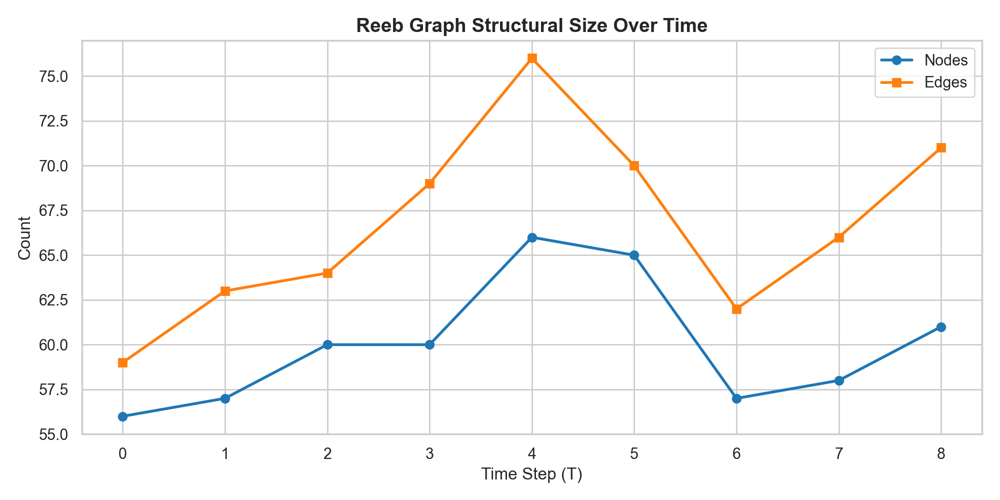
  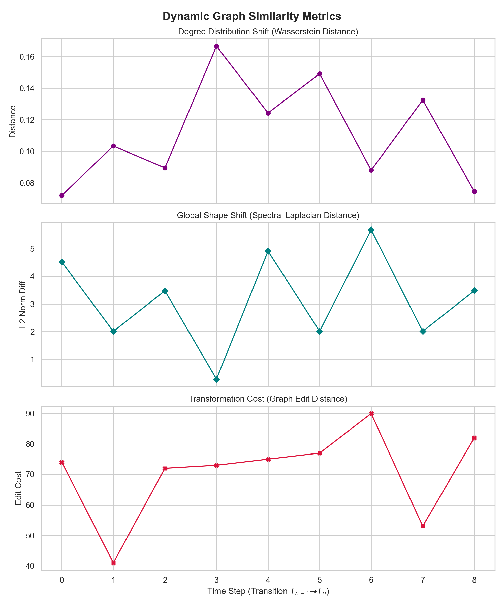
  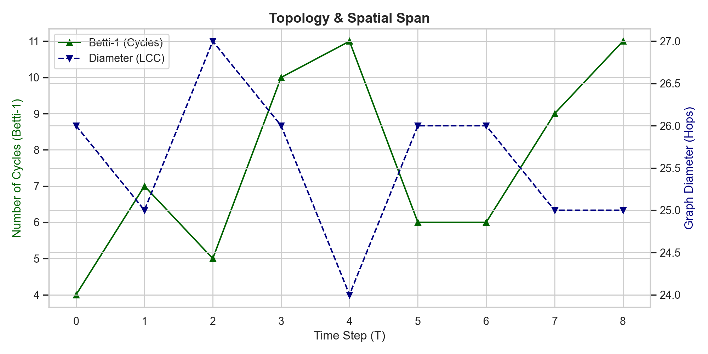
</div>

</details>
</details>
</details>

<details>
<summary><strong><span style="font-size:25px;">Graph Similarity Metrics</span></strong></summary>

Having the graphs that enode the geometry of the transformation on the time step $t_i$ we can compute pairwise similarity metrics with the following code this will generate a csv with the resuslts and the corresponding plot within the path /PynamicMes/Results/scene1/Graph_analysis.


```python
from PynamicMesh.core.pipelines import run_pipeline
run_pipeline(**args)
```

In order to track the Graph Similarity, run:

```python
from PynamicMesh.core.pipelines import run_pipeline
run_pipeline(
    path_str='base/path',
    graph_sim = True, 
    graph_metrics = 'all'
    )
```

Or you can set your parameters on the [yaml](./examples/config.yaml) file, and within the PynamicMesh enviroment run on the comand line:

```python
run_pynamic --config /path/to/the/config.yaml
```

<b>Note: Graph Similarity Metrics vs. Time Graph AnalysisWhile</b>  

Both tools evaluate the generated Reeb Graphs, they serve completely different analytical purposes: 

Time Graph Analysis: Tracks consecutive animation frames $t_{i-1} \to t_i$ to pinpoint exactly when a structural event occurs. By relying on direct physical modification costs like Graph Edit Distance, alongside node and cycle counts, it flags the exact moment a mesh physically breaks, merges, or sprouts new limbs. 

Graph Similarity Metrics (The TDA Benchmark): Focuses on the mathematical nature of the deformation rather than discrete timeline events. It uses advanced Topological Data Analysis (TDA) distances to measure continuous geometric changes. Instead of just counting broken branches, it evaluates how scalar height values shift (Interleaving Distance), how internal travel pathways warp (Function Distortion Distance), how local junctions reorganize (Degree Wasserstein), how macro-level global structures deform (Spectral Laplacian), and tracks pure topological tearing and gluing independent of the shape's scale (Branch Decomposition).


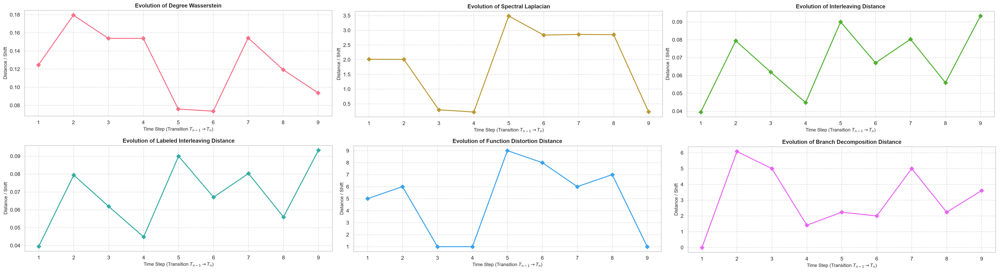

<details>
<summary><span style="font-size:23px;">Graph Similarity Parameters</span></summary>

Path to the root folder that contains the scenes:
```python 
path_str (str) 
```   

Flag to indicate the execution:
```python 
graph_sim (bool)
```  

Desired metrics to track:

```python 
graph_metrics (str) | (list)
```
<details>
<summary><span style="font-size:21px;">Available metrics</span></summary>

Compute and report all the available metrics :

```python 
graph_metrics (str) : 'all'
```

Compute just the selected set of metrics :

```python 
graph_metrics (list) : ['metric_1',...,'metric_n']
```


<b>Degree Wasserstein Distance:</b>

```degree_wasserstein``` measures the difference in how "busy" or interconnected the junctions (nodes) are in the graph. This tracks local branching changes. If the mesh splits or merges, the junctions on the skeleton get more or fewer connections. A high value means the complexity of the intersections has shifted dramatically.

<b>Spectral Laplacian Distance:</b>

```spectral_laplacian``` measures the global "fingerprint" or structural vibe of the graph based on its overall matrix structure. This tracks major global shape deformations. We can think of it as looking at the big picture. If the mesh undergoes a massive twist, a huge stretch, or collapses entirely, this metric will spike. It is excellent for catching massive, macro-level structural changes rather than tiny details.

<b>Interleaving Distance & Labeled Interleaving Distance:</b>

```interleaving_distance``` , ```labeled_interleaving_distance```  measures the difference in the height or position (the scalar values) of the graph's features.  This tracks spatial stretching or shifting along an axis. Because it looks at the positions (pos or bin) of the nodes, it tell us if the mesh is being pulled upward, compressed downward, or if features are migrating along the direction of your measurement function.

<b>Note:</b> Interleaving Distance = Labeled Interleaving Distance when the vertices (nodes) of the graph don't have a 'label' attribute set.


<b>Function Distortion Distance:</b>

```function_distortion_distance``` measures the difference in the "shortest travel distance" between all points on the graph. This tracks elongation and structural shortening. This metric catches how much the "internal travel distance" across the mesh's skeleton is warping.

<b>Branch Decomposition Distance:</b>

```branch_decomposition_distance``` measures the literal count of loops/holes (Betti numbers) and major branching points in the graph. This tracks pure topological tearing or gluing. It completely ignores how long or tall the shape is and focuses strictly on structure. If your deforming mesh rips open a new hole (like dough pulling apart) or sprouts a brand new limb, this metric registers that discrete structural change.

</details>
</details>
</details>

<details>
<summary><strong><span style="font-size:25px;">Batch Analysis Notes</span></strong></summary>

The described methods on the previous sections allow us to configure specific sets of parameters for computing each mesh within a timelapse, or alternatively, to apply a consistent set of parameters across different timelapses. Naturally, it may be necessary to use unique parameter sets for distinct timelapses for instance, when applying different scalar fields for Reeb graphs for example or when processing timelapses of varying natures or sample types.

To better organize and manage these multi-parameter configurations, it is possible to define a unique set of parameters for each timelapse within the [yaml](./examples/config_batch.yaml) configuration file and execute the following instruction within the conda environment.

```python
run_pynamic --config /path/to/the/config_batch.yaml  --batch
```

Or execute programatically as

```python
from PynamicMesh.utils.batch import run_batch
from PynamicMesh.utils.tools import extract_yaml

config_path = '\PynamicMesh\examples\config_batch.yaml'

config = extract_yaml(config_path)
data_cfg = config.get("Data", {})
path_str = data_cfg.get("path_str")
run_batch(config,path_str)
```


</details>


<!-- <details>
<summary><strong><span style="font-size:25px;">Functional Map</span></strong></summary>
</details> -->